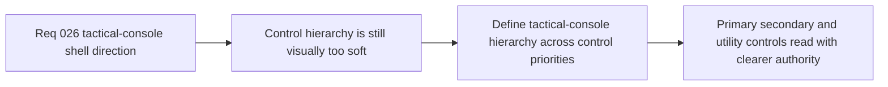

## item_104_define_tactical_console_hierarchy_for_primary_secondary_and_utility_shell_controls - Define tactical-console hierarchy for primary, secondary, and utility shell controls
> From version: 0.2.1
> Status: Done
> Understanding: 99%
> Confidence: 96%
> Progress: 100%
> Complexity: Medium
> Theme: UX
> Reminder: Update status/understanding/confidence/progress and linked task references when you edit this doc.

# Problem
- The command deck now has a stronger information hierarchy, but the visual difference between primary, secondary, and utility controls is still too soft.
- Without a dedicated hierarchy pass, important actions such as the primary CTA do not read with enough authority relative to supporting or debug-oriented controls.

# Scope
- In: Defining visual hierarchy for shell CTAs and lower-priority controls, including emphasis, density, border treatment, and state expression across primary, secondary, and utility actions.
- Out: Rewriting the command-deck grouping model, changing shell actions, or redesigning diagnostics content.

# Acceptance criteria
- AC1: The slice defines a tactical-console visual hierarchy for primary, secondary, and utility shell controls.
- AC2: The slice defines how the primary CTA should stand apart from supporting shell actions without relying on pill-style softness.
- AC3: The slice defines a subordinate treatment for lower-priority or debug-oriented controls such as diagnostics and inspection.
- AC4: The slice remains compatible with the current command-deck structure and action inventory.

# AC Traceability
- AC1 -> Scope: Hierarchy posture is explicit. Proof target: hierarchy notes, CSS plan, or implementation report.
- AC2 -> Scope: Primary CTA treatment is explicit. Proof target: CTA emphasis notes or implemented styling.
- AC3 -> Scope: Utility treatment is explicit. Proof target: lower-priority control treatment notes.
- AC4 -> Scope: Existing command deck remains intact. Proof target: compatibility notes with current grouping.

# Decision framing
- Product framing: Primary
- Product signals: usability, emphasis, and control readability
- Product follow-up: Ensure the shell guides attention toward the right command through visual authority, not only through grouping.
- Architecture framing: Supporting
- Architecture signals: shell chrome and debug gating
- Architecture follow-up: Keep the current shell command structure stable while improving the visual priority model.

# Links
- Product brief(s): `prod_001_minimal_overlay_and_feedback_for_early_runtime`
- Architecture decision(s): `adr_022_keep_product_meta_flow_shell_owned_while_runtime_state_remains_game_preserved`, `adr_025_keep_shell_chrome_event_driven_and_sample_diagnostics_off_the_runtime_hot_path`
- Request: `req_026_define_a_tactical_console_visual_direction_for_shell_controls_and_menus`
- Primary task(s): `task_033_orchestrate_tactical_console_visual_direction_for_shell_controls_and_menus`

# Priority
- Impact: High
- Urgency: Medium

# Notes
- Derived from request `req_026_define_a_tactical_console_visual_direction_for_shell_controls_and_menus`.
- Source file: `logics/request/req_026_define_a_tactical_console_visual_direction_for_shell_controls_and_menus.md`.
- Implemented through `task_033_orchestrate_tactical_console_visual_direction_for_shell_controls_and_menus`.
- The command deck now exposes a labeled primary CTA module plus explicit `secondary` and `utility` action treatments so session/view commands and tool toggles no longer compete with equal visual authority.
