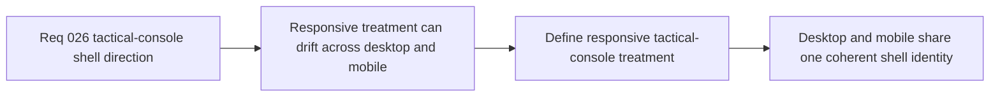

## item_105_define_responsive_tactical_console_treatment_for_mobile_sheet_and_desktop_command_deck - Define responsive tactical-console treatment for mobile sheet and desktop command deck
> From version: 0.5.0
> Status: Done
> Understanding: 98%
> Confidence: 95%
> Progress: 100%
> Complexity: Medium
> Theme: UX
> Reminder: Update status/understanding/confidence/progress and linked task references when you edit this doc.

# Problem
- The shell already adapts between desktop command deck and mobile sheet, but the new tactical-console direction still needs a breakpoint-aware treatment that feels coherent rather than simply scaled down.
- Without a dedicated responsive slice, the desktop and mobile shells can drift into inconsistent expressions of the same visual language.

# Scope
- In: Defining how the tactical-console direction should adapt across the desktop command deck and the mobile sheet, including spacing, framing, touch targets, and control density.
- Out: Moving the trigger, redefining the action model, or opening a broader responsive redesign of the whole app shell.

# Acceptance criteria
- AC1: The slice defines a responsive tactical-console treatment for both the desktop command deck and the mobile sheet.
- AC2: The slice defines how spacing, framing, and control density should adapt by breakpoint without losing the same visual identity.
- AC3: The slice defines touch-appropriate treatment for mobile while preserving the desktop command deck’s sharper console posture.
- AC4: The slice keeps the current trigger position and shell-owned menu model intact.

# AC Traceability
- AC1 -> Scope: Responsive posture is explicit. Proof target: breakpoint notes, styling plan, or implementation report.
- AC2 -> Scope: Adaptation rules are explicit. Proof target: spacing or density treatment notes.
- AC3 -> Scope: Mobile touch treatment is explicit. Proof target: mobile-specific control treatment notes.
- AC4 -> Scope: Existing shell model remains intact. Proof target: compatibility notes.

# Request AC Traceability
- req_026_define_a_tactical_console_visual_direction_for_shell_controls_and_menus coverage: AC1, AC2, AC3, AC4, AC5, AC6. Proof: `item_105_define_responsive_tactical_console_treatment_for_mobile_sheet_and_desktop_command_deck` remains the request-closing backlog slice for `req_026_define_a_tactical_console_visual_direction_for_shell_controls_and_menus` and stays linked to `task_033_orchestrate_tactical_console_visual_direction_for_shell_controls_and_menus` for delivered implementation evidence.

# Decision framing
- Product framing: Primary
- Product signals: mobile usability and consistency
- Product follow-up: Make the tactical-console direction hold together across handheld and desktop play surfaces.
- Architecture framing: Supporting
- Architecture signals: responsive shell overlay posture
- Architecture follow-up: Adapt presentation by breakpoint without reopening command ownership.

# Links
- Product brief(s): `prod_001_minimal_overlay_and_feedback_for_early_runtime`
- Architecture decision(s): `adr_002_separate_react_shell_from_pixi_runtime_ownership`, `adr_016_define_shell_scene_state_and_meta_surface_ownership`, `adr_025_keep_shell_chrome_event_driven_and_sample_diagnostics_off_the_runtime_hot_path`
- Request: `req_026_define_a_tactical_console_visual_direction_for_shell_controls_and_menus`
- Primary task(s): `task_033_orchestrate_tactical_console_visual_direction_for_shell_controls_and_menus`

# Priority
- Impact: Medium
- Urgency: Medium

# Notes
- Derived from request `req_026_define_a_tactical_console_visual_direction_for_shell_controls_and_menus`.
- Source file: `logics/request/req_026_define_a_tactical_console_visual_direction_for_shell_controls_and_menus.md`.
- Implemented through `task_033_orchestrate_tactical_console_visual_direction_for_shell_controls_and_menus`.
- Desktop and mobile now share the same tactical-console framing, with mobile-specific trigger density, sheet geometry, and touch spacing layered on top of the existing shell-owned command-deck model.
