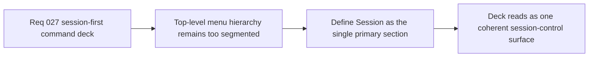

## item_106_define_session_as_the_single_primary_shell_menu_section - Define Session as the single primary shell-menu section
> From version: 0.2.1
> Status: Draft
> Understanding: 97%
> Confidence: 95%
> Progress: 0%
> Complexity: Medium
> Theme: UX
> Reminder: Update status/understanding/confidence/progress and linked task references when you edit this doc.

# Problem
- The current command deck still exposes `Session`, `View`, and `Tools` as peer top-level sections even though `Session` is the only truly primary command family beneath the always-visible current action.
- Without a dedicated restructuring slice, the deck remains more segmented and top-heavy than the intended session-first product model.

# Scope
- In: Defining `Session` as the single first-level section beneath the current action, including its role, prominence, and compatibility with the current command-deck shell.
- Out: Redesigning the shell trigger, changing the current action model, or redefining the tactical-console visual language.

# Acceptance criteria
- AC1: The slice defines `Session` as the single primary first-level section beneath the always-visible current action.
- AC2: The slice defines how current top-level peers should be absorbed under the new session-first model without removing access to existing actions.
- AC3: The slice preserves the current command-deck shell model and tactical-console posture while changing only the grouping hierarchy.
- AC4: The slice keeps the change bounded to shell IA refinement and does not reopen ownership or broader HUD design.

# AC Traceability
- AC1 -> Scope: Session-first posture is explicit. Proof target: IA note, component plan, or implementation report.
- AC2 -> Scope: Action preservation is explicit. Proof target: mapping from current sections to new structure.
- AC3 -> Scope: Existing shell model remains valid. Proof target: compatibility note with current deck.
- AC4 -> Scope: Slice remains bounded. Proof target: no ownership or visual-direction redesign.

# Decision framing
- Product framing: Primary
- Product signals: clarity, compactness, and command priority
- Product follow-up: Make the command deck read like one session-control surface instead of several parallel control families.
- Architecture framing: Supporting
- Architecture signals: shell menu IA
- Architecture follow-up: Preserve current shell ownership while tightening top-level structure.

# Links
- Product brief(s): `prod_001_minimal_overlay_and_feedback_for_early_runtime`
- Architecture decision(s): `adr_002_separate_react_shell_from_pixi_runtime_ownership`, `adr_016_define_shell_scene_state_and_meta_surface_ownership`, `adr_025_keep_shell_chrome_event_driven_and_sample_diagnostics_off_the_runtime_hot_path`
- Request: `req_027_restructure_the_shell_command_deck_around_a_primary_session_section`
- Primary task(s): None yet

# Priority
- Impact: High
- Urgency: Medium

# Notes
- Derived from request `req_027_restructure_the_shell_command_deck_around_a_primary_session_section`.
- Source file: `logics/request/req_027_restructure_the_shell_command_deck_around_a_primary_session_section.md`.
