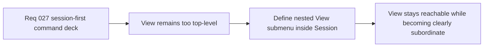

## item_107_define_nested_view_controls_within_session_without_reopening_camera_ownership - Define nested View controls within Session without reopening camera ownership
> From version: 0.2.2
> Status: Done
> Understanding: 99%
> Confidence: 96%
> Progress: 100% (docs synced)
> Complexity: Medium
> Theme: UX
> Reminder: Update status/understanding/confidence/progress and linked task references when you edit this doc.

# Problem
- `View` controls such as reset camera and camera mode are currently readable and functional, but they still appear as a top-level section even though they behave more like a subordinate session adjustment space.
- Without a dedicated slice, the new session-first command deck could either over-hide view controls or leave them visually too prominent relative to true session actions.

# Scope
- In: Defining how `View` should be nested inside `Session`, including submenu or equivalent focused navigation treatment, reachability, and preservation of reset-camera and camera-mode controls.
- Out: Reopening camera ownership, redefining camera behavior, or redesigning the current camera control contract.

# Acceptance criteria
- AC1: The slice defines how `View` becomes a nested group or submenu inside `Session` rather than a peer top-level section.
- AC2: The slice preserves access to `Reset camera` and `Camera mode` under the new nested structure.
- AC3: The slice defines how the nested `View` group remains readable and usable without reopening camera ownership or behavior.
- AC4: The slice remains compatible with the current command-deck shell and tactical-console direction.

# AC Traceability
- AC1 -> Scope: Nested View posture is explicit. Proof target: IA note, nested-group plan, or implementation report.
- AC2 -> Scope: Existing view actions are preserved. Proof target: action mapping or rendered structure.
- AC3 -> Scope: Camera ownership remains untouched. Proof target: bounded scope note.
- AC4 -> Scope: Current shell model remains intact. Proof target: compatibility note with current deck.

# Decision framing
- Product framing: Primary
- Product signals: clarity and ease of adjustment
- Product follow-up: Keep camera controls easy to reach while making their subordinate role explicit.
- Architecture framing: Supporting
- Architecture signals: camera control presentation
- Architecture follow-up: Preserve current camera ownership and contract while changing only the shell menu grouping.

# Links
- Product brief(s): `prod_001_minimal_overlay_and_feedback_for_early_runtime`
- Architecture decision(s): `adr_002_separate_react_shell_from_pixi_runtime_ownership`, `adr_025_keep_shell_chrome_event_driven_and_sample_diagnostics_off_the_runtime_hot_path`
- Request: `req_027_restructure_the_shell_command_deck_around_a_primary_session_section`
- Primary task(s): `task_034_orchestrate_session_first_shell_command_deck_hierarchy`

# Priority
- Impact: Medium
- Urgency: Medium

# Notes
- Derived from request `req_027_restructure_the_shell_command_deck_around_a_primary_session_section`.
- Source file: `logics/request/req_027_restructure_the_shell_command_deck_around_a_primary_session_section.md`.
- Implemented through `task_034_orchestrate_session_first_shell_command_deck_hierarchy`.
- `View` is now nested inside `Session` as a dedicated submenu, with `Reset camera` and `Camera mode` preserved as reachable camera controls without reopening camera ownership or behavior.
