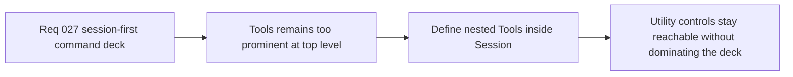

## item_108_define_nested_tools_controls_within_session_without_reintroducing_menu_clutter - Define nested Tools controls within Session without reintroducing menu clutter
> From version: 0.2.1
> Status: Done
> Understanding: 98%
> Confidence: 95%
> Progress: 100%
> Complexity: Medium
> Theme: UX
> Reminder: Update status/understanding/confidence/progress and linked task references when you edit this doc.

# Problem
- `Tools` currently sits as a peer top-level section even though its contents are the lowest-priority controls in the command deck.
- Without a dedicated nesting slice, tool toggles risk either staying too prominent or becoming awkwardly hidden in a way that hurts debug reachability.

# Scope
- In: Defining how `Tools` becomes a nested subordinate group inside `Session`, including treatment of inspecteur, diagnostics, and install actions without bringing back top-level clutter.
- Out: Redesigning diagnostics content, changing install capability rules, or changing debug feature ownership.

# Acceptance criteria
- AC1: The slice defines how `Tools` becomes a nested subordinate group inside `Session` rather than a peer top-level section.
- AC2: The slice preserves access to `Inspecteur`, `Diagnostics`, and `Install` under the new nested structure.
- AC3: The slice defines how the nested `Tools` group remains lower-priority and less cluttering than the current peer-section model.
- AC4: The slice remains compatible with the current shell-owned menu model and tactical-console direction.

# AC Traceability
- AC1 -> Scope: Nested Tools posture is explicit. Proof target: IA note, nested-group plan, or implementation report.
- AC2 -> Scope: Existing utility actions are preserved. Proof target: action mapping or rendered structure.
- AC3 -> Scope: Lower-priority treatment is explicit. Proof target: priority note or implementation report.
- AC4 -> Scope: Current shell model remains intact. Proof target: compatibility note with current deck.

# Decision framing
- Product framing: Primary
- Product signals: clarity and clutter control
- Product follow-up: Keep utility actions reachable without letting them compete with core session controls.
- Architecture framing: Supporting
- Architecture signals: diagnostics and install gating presentation
- Architecture follow-up: Preserve current feature ownership while moving tools into a more subordinate shell IA position.

# Links
- Product brief(s): `prod_001_minimal_overlay_and_feedback_for_early_runtime`
- Architecture decision(s): `adr_002_separate_react_shell_from_pixi_runtime_ownership`, `adr_025_keep_shell_chrome_event_driven_and_sample_diagnostics_off_the_runtime_hot_path`
- Request: `req_027_restructure_the_shell_command_deck_around_a_primary_session_section`
- Primary task(s): `task_034_orchestrate_session_first_shell_command_deck_hierarchy`

# Priority
- Impact: Medium
- Urgency: Medium

# Notes
- Derived from request `req_027_restructure_the_shell_command_deck_around_a_primary_session_section`.
- Source file: `logics/request/req_027_restructure_the_shell_command_deck_around_a_primary_session_section.md`.
- Implemented through `task_034_orchestrate_session_first_shell_command_deck_hierarchy`.
- `Tools` is now nested inside `Session` with a more subordinate treatment, while `Inspecteur`, `Diagnostics`, and `Install` remain available without restoring top-level clutter.
