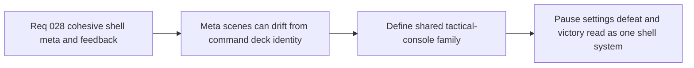

## item_109_define_a_shared_tactical_console_family_for_shell_owned_meta_scenes - Define a shared tactical-console family for shell-owned meta scenes
> From version: 0.2.2
> Status: Draft
> Understanding: 97%
> Confidence: 95%
> Progress: 0%
> Complexity: Medium
> Theme: UX
> Reminder: Update status/understanding/confidence/progress and linked task references when you edit this doc.

# Problem
- The command deck now has a clear tactical-console posture, but shell-owned meta scenes such as `pause`, `settings`, `defeat`, and `victory` can still read like separate overlay designs.
- Without a dedicated shell-family slice, the product risks ending up with one polished menu and several weaker meta surfaces around it.

# Scope
- In: Defining a shared tactical-console family for shell-owned meta scenes, including framing, hierarchy, CTA posture, and visual continuity with the command deck.
- Out: Reworking gameplay systems, redesigning the command-deck IA again, or redefining debug tooling surfaces.

# Acceptance criteria
- AC1: The slice defines a shared tactical-console family across `pause`, `settings`, `defeat`, and `victory` rather than allowing each shell-owned scene to drift independently.
- AC2: The slice defines how scene framing and CTA hierarchy should stay compatible with the command-deck posture without forcing identical layouts everywhere.
- AC3: The slice preserves shell ownership and runtime-state continuity while tightening visual and structural coherence across meta scenes.
- AC4: The slice remains focused on shell-owned meta-scene UX and does not reopen gameplay HUD or runtime instrumentation redesign.

# AC Traceability
- AC1 -> Scope: Shared family posture is explicit. Proof target: scene-family rules, design notes, or implementation report.
- AC2 -> Scope: Framing and CTA hierarchy remain aligned. Proof target: hierarchy notes or rendered scene structure.
- AC3 -> Scope: Shell ownership and preserved runtime-state posture remain intact. Proof target: compatibility notes or scene behavior report.
- AC4 -> Scope: Wave remains bounded to shell-owned meta scenes. Proof target: scope note or implementation summary.

# Decision framing
- Product framing: Primary
- Product signals: cohesion and scene readability
- Product follow-up: Make the shell feel like one product family rather than a menu plus unrelated meta cards.
- Architecture framing: Supporting
- Architecture signals: shell scene ownership continuity
- Architecture follow-up: Preserve the current shell/runtime boundary while aligning scene presentation.

# Links
- Product brief(s): `prod_001_minimal_overlay_and_feedback_for_early_runtime`
- Architecture decision(s): `adr_002_separate_react_shell_from_pixi_runtime_ownership`, `adr_016_define_shell_scene_state_and_meta_surface_ownership`, `adr_025_keep_shell_chrome_event_driven_and_sample_diagnostics_off_the_runtime_hot_path`
- Request: `req_028_define_a_cohesive_shell_meta_and_runtime_feedback_surface`

# Priority
- Impact: Medium
- Urgency: Medium

# Notes
- Derived from request `req_028_define_a_cohesive_shell_meta_and_runtime_feedback_surface`.
- Source file: `logics/request/req_028_define_a_cohesive_shell_meta_and_runtime_feedback_surface.md`.
