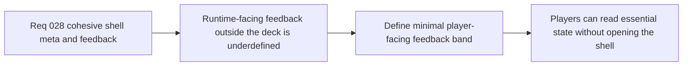

## item_110_define_a_minimal_player_facing_runtime_feedback_band_outside_the_command_deck - Define a minimal player-facing runtime feedback band outside the command deck
> From version: 0.2.2
> Status: Draft
> Understanding: 97%
> Confidence: 95%
> Progress: 0%
> Complexity: Medium
> Theme: UX
> Reminder: Update status/understanding/confidence/progress and linked task references when you edit this doc.

# Problem
- The runtime currently relies too heavily on opening the command deck to read shell-adjacent state, while the always-visible player-facing HUD remains underdefined.
- Without a dedicated feedback-band slice, the runtime risks either staying too silent or overcorrecting into a cluttered always-on HUD.

# Scope
- In: Defining a minimal player-facing runtime feedback band or HUD layer outside the command deck, including essential visible signals and their placement expectations.
- Out: Turning the HUD into a second control deck, surfacing diagnostics, or redesigning gameplay systems.

# Acceptance criteria
- AC1: The slice defines a minimal player-facing runtime feedback band that remains visible without opening the command deck.
- AC2: The slice defines which session or runtime signals are essential enough to surface persistently and which should remain hidden until requested.
- AC3: The slice keeps the feedback posture intentionally sparse so the runtime surface stays readable on both mobile and desktop.
- AC4: The slice preserves the command deck as the main control surface while positioning the HUD as a read surface only.

# AC Traceability
- AC1 -> Scope: Always-visible feedback posture is explicit. Proof target: HUD note, placement rule, or implementation report.
- AC2 -> Scope: Signal selection is explicit. Proof target: allowed-signal list or rendered HUD structure.
- AC3 -> Scope: Density expectations remain explicit. Proof target: compactness rules or implementation note.
- AC4 -> Scope: Control vs read-surface split remains intact. Proof target: compatibility note or behavior summary.

# Decision framing
- Product framing: Primary
- Product signals: readability and low-friction comprehension
- Product follow-up: Let the runtime communicate essential state without requiring menu-first reading.
- Architecture framing: Supporting
- Architecture signals: separation between shell chrome and player HUD
- Architecture follow-up: Preserve the menu as the control surface while defining the HUD as a bounded read surface.

# Links
- Product brief(s): `prod_001_minimal_overlay_and_feedback_for_early_runtime`
- Architecture decision(s): `adr_002_separate_react_shell_from_pixi_runtime_ownership`, `adr_025_keep_shell_chrome_event_driven_and_sample_diagnostics_off_the_runtime_hot_path`
- Request: `req_028_define_a_cohesive_shell_meta_and_runtime_feedback_surface`

# Priority
- Impact: Medium
- Urgency: Medium

# Notes
- Derived from request `req_028_define_a_cohesive_shell_meta_and_runtime_feedback_surface`.
- Source file: `logics/request/req_028_define_a_cohesive_shell_meta_and_runtime_feedback_surface.md`.
