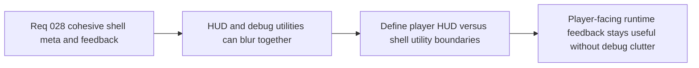

## item_111_define_boundaries_between_player_hud_information_and_shell_debug_utilities - Define boundaries between player HUD information and shell debug utilities
> From version: 0.2.2
> Status: Draft
> Understanding: 97%
> Confidence: 95%
> Progress: 0%
> Complexity: Medium
> Theme: UX
> Reminder: Update status/understanding/confidence/progress and linked task references when you edit this doc.

# Problem
- As the shell and HUD evolve, player-facing runtime information can easily blur together with debug or utility surfaces such as diagnostics and inspecteur.
- Without a dedicated boundary slice, the next HUD wave could regress into always-visible debug clutter or duplicate shell utilities in player-facing UI.

# Scope
- In: Defining boundaries between player-facing HUD information and shell/debug utilities, including what remains menu-gated versus what deserves persistent visibility.
- Out: Redesigning diagnostics content, changing instrumentation payloads, or reworking debug ownership.

# Acceptance criteria
- AC1: The slice defines boundaries between always-visible player-facing HUD information and shell- or menu-gated debug utilities.
- AC2: The slice explicitly keeps diagnostics, inspecteur, and similar operator surfaces out of the minimal player-facing HUD unless reclassified as true product signals.
- AC3: The slice defines how those boundaries remain readable across desktop and mobile without duplicating command-deck responsibilities.
- AC4: The slice remains compatible with the current shell-owned command deck and diagnostic gating posture.

# AC Traceability
- AC1 -> Scope: HUD vs utility boundary is explicit. Proof target: boundary note, UX rule, or implementation report.
- AC2 -> Scope: Diagnostics and inspecteur remain gated. Proof target: signal classification or rendered UI structure.
- AC3 -> Scope: Responsive implications are explicit. Proof target: desktop/mobile notes or layout treatment summary.
- AC4 -> Scope: Current shell model remains intact. Proof target: compatibility note or behavior summary.

# Decision framing
- Product framing: Primary
- Product signals: clarity and discipline
- Product follow-up: Keep player HUD useful without turning it into an operator console.
- Architecture framing: Supporting
- Architecture signals: debug gating and shell ownership
- Architecture follow-up: Preserve menu-driven utility access while the HUD grows carefully.

# Links
- Product brief(s): `prod_001_minimal_overlay_and_feedback_for_early_runtime`
- Architecture decision(s): `adr_006_standardize_debug_first_runtime_instrumentation`, `adr_025_keep_shell_chrome_event_driven_and_sample_diagnostics_off_the_runtime_hot_path`
- Request: `req_028_define_a_cohesive_shell_meta_and_runtime_feedback_surface`

# Priority
- Impact: Medium
- Urgency: Medium

# Notes
- Derived from request `req_028_define_a_cohesive_shell_meta_and_runtime_feedback_surface`.
- Source file: `logics/request/req_028_define_a_cohesive_shell_meta_and_runtime_feedback_surface.md`.
