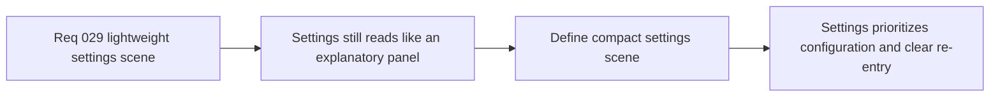

## item_112_define_a_compact_settings_meta_scene_that_prioritizes_configuration_over_context_copy - Define a compact settings meta scene that prioritizes configuration over context copy
> From version: 0.2.2
> Status: Done
> Understanding: 98%
> Confidence: 96%
> Progress: 100%
> Complexity: Medium
> Theme: UX
> Reminder: Update status/understanding/confidence/progress and linked task references when you edit this doc.

# Problem
- The current `Settings` shell scene still spends too much space explaining shell ownership and runtime re-entry instead of helping the user configure anything.
- Without a dedicated compaction slice, `Settings` risks staying a large explanatory card rather than a tight and useful meta scene.

# Scope
- In: Defining a lighter settings-scene structure that removes or sharply reduces redundant context copy and prioritizes actual configuration content plus a clear runtime re-entry CTA.
- Out: Broad command-deck redesign, HUD redesign, or non-settings meta-scene rework beyond what is needed for consistency.

# Acceptance criteria
- AC1: The slice defines a compact settings-scene structure that sharply reduces redundant shell/runtime explanatory copy.
- AC2: The slice defines how a short scene label and minimal supporting text can replace the current oversized documentation posture.
- AC3: The slice preserves an obvious runtime re-entry CTA while making configuration content the main body of the scene.
- AC4: The slice remains compatible with shell ownership and preserved runtime-state continuity.

# AC Traceability
- AC1 -> Scope: Copy reduction is explicit. Proof target: scene IA note, content audit, or implementation report.
- AC2 -> Scope: Compact intro posture is explicit. Proof target: structure note or rendered scene header.
- AC3 -> Scope: Re-entry CTA and configuration-body split are explicit. Proof target: CTA hierarchy or scene layout report.
- AC4 -> Scope: Shell-owned scene behavior remains intact. Proof target: compatibility note or behavior summary.

# Decision framing
- Product framing: Primary
- Product signals: usefulness and focus
- Product follow-up: Make `Settings` feel like a real product surface rather than shell documentation.
- Architecture framing: Supporting
- Architecture signals: shell-owned scene continuity
- Architecture follow-up: Preserve runtime-state continuity while reducing scene verbosity.

# Links
- Product brief(s): `prod_001_minimal_overlay_and_feedback_for_early_runtime`
- Architecture decision(s): `adr_002_separate_react_shell_from_pixi_runtime_ownership`, `adr_016_define_shell_scene_state_and_meta_surface_ownership`
- Request: `req_029_define_a_lightweight_settings_scene_with_desktop_control_customization`

# Priority
- Impact: Medium
- Urgency: Medium

# Notes
- Derived from request `req_029_define_a_lightweight_settings_scene_with_desktop_control_customization`.
- Source file: `logics/request/req_029_define_a_lightweight_settings_scene_with_desktop_control_customization.md`.
- Delivered in `src/app/components/AppMetaScenePanel.tsx`, where `Settings` now foregrounds configuration content and limits context copy to one short supporting line.
