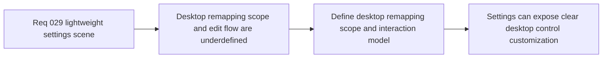

## item_113_define_desktop_control_remapping_scope_and_interaction_model_for_settings - Define desktop control remapping scope and interaction model for settings
> From version: 0.2.2
> Status: Draft
> Understanding: 98%
> Confidence: 96%
> Progress: 0%
> Complexity: Medium
> Theme: UX
> Reminder: Update status/understanding/confidence/progress and linked task references when you edit this doc.

# Problem
- `Settings` is the natural home for desktop-control customization, but the allowed scope and interaction model for remapping are not yet explicit.
- Without a dedicated remapping slice, the feature can sprawl into every binding at once or produce a confusing capture/edit flow.

# Scope
- In: Defining the first desktop-control remapping scope, the interaction model for editing bindings, and the initial categories of supported player-facing desktop controls.
- Out: Mobile remapping, debug/operator binding customization, or deep input-system redesign unrelated to the first desktop settings experience.

# Acceptance criteria
- AC1: The slice defines the first supported desktop-control remapping scope for player-facing controls in settings.
- AC2: The slice defines a clear interaction model for selecting a binding, capturing a replacement input, and presenting the resulting value.
- AC3: The slice keeps debug-only or operator bindings out of the same remapping surface.
- AC4: The slice remains compatible with the current shell-owned settings scene and desktop input ownership posture.

# AC Traceability
- AC1 -> Scope: Supported remapping set is explicit. Proof target: control list, settings model, or implementation report.
- AC2 -> Scope: Editing flow is explicit. Proof target: interaction note, capture behavior, or rendered UI flow.
- AC3 -> Scope: Debug bindings remain excluded. Proof target: scope note or binding taxonomy.
- AC4 -> Scope: Existing input ownership posture remains intact. Proof target: compatibility note or behavior summary.

# Decision framing
- Product framing: Primary
- Product signals: usability and user control
- Product follow-up: Introduce a settings feature that solves a real desktop usability need without over-expanding scope.
- Architecture framing: Supporting
- Architecture signals: input ownership and configuration persistence
- Architecture follow-up: Keep player-facing desktop remapping bounded and explicit.

# Links
- Product brief(s): `prod_001_minimal_overlay_and_feedback_for_early_runtime`
- Architecture decision(s): `adr_007_isolate_runtime_input_from_browser_page_controls`, `adr_016_define_shell_scene_state_and_meta_surface_ownership`
- Request: `req_029_define_a_lightweight_settings_scene_with_desktop_control_customization`

# Priority
- Impact: Medium
- Urgency: Medium

# Notes
- Derived from request `req_029_define_a_lightweight_settings_scene_with_desktop_control_customization`.
- Source file: `logics/request/req_029_define_a_lightweight_settings_scene_with_desktop_control_customization.md`.

