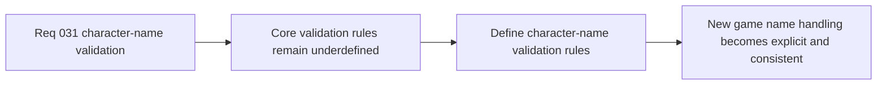

## item_115_define_character_name_validation_rules_for_new_game_entry - Define character-name validation rules for new-game entry
> From version: 0.2.2
> Status: Draft
> Understanding: 98%
> Confidence: 96%
> Progress: 0%
> Complexity: Low
> Theme: UX
> Reminder: Update status/understanding/confidence/progress and linked task references when you edit this doc.

# Problem
- The `New game` flow now depends on a required character name, but the validation rules are not yet explicit enough to keep UI, session creation, and storage aligned.
- Without a dedicated validation-rules slice, the product can drift into inconsistent handling for length, allowed characters, whitespace, or obviously low-quality names.

# Scope
- In: Defining first-slice validation rules for the character-name field, including length, allowed characters, whitespace handling, and rejection of all-numeric values.
- Out: Moderation policy, profanity filtering, post-start renaming, multiplayer identity, or broader profile systems.

# Acceptance criteria
- AC1: The slice defines the first-slice minimum and maximum length for character names.
- AC2: The slice defines the allowed-character set appropriate for the first release of `New game`.
- AC3: The slice defines trim and whitespace-handling behavior clearly enough to prevent effectively empty names.
- AC4: The slice defines whether all-numeric names are rejected and keeps the rules compatible with a lightweight first-slice UX.

# AC Traceability
- AC1 -> Scope: Length window is explicit. Proof target: validation rule set or implementation report.
- AC2 -> Scope: Allowed-character set is explicit. Proof target: validation note, regex contract, or implementation summary.
- AC3 -> Scope: Whitespace handling is explicit. Proof target: normalization rule or UI behavior summary.
- AC4 -> Scope: Low-quality numeric-only names are handled explicitly. Proof target: validation rule or behavior note.

# Decision framing
- Product framing: Primary
- Product signals: clarity and user trust
- Product follow-up: Keep the first naming contract simple enough to understand and strict enough to avoid bad downstream UI states.
- Architecture framing: Supporting
- Architecture signals: session bootstrap input contract
- Architecture follow-up: Keep validation bounded so persistence and session creation can share one explicit rule set.

# Links
- Product brief(s): `prod_001_minimal_overlay_and_feedback_for_early_runtime`
- Architecture decision(s): `adr_002_separate_react_shell_from_pixi_runtime_ownership`, `adr_016_define_shell_scene_state_and_meta_surface_ownership`
- Request: `req_031_define_character_name_validation_and_constraints_for_new_game_entry`

# Priority
- Impact: Medium
- Urgency: Medium

# Notes
- Derived from request `req_031_define_character_name_validation_and_constraints_for_new_game_entry`.
- Source file: `logics/request/req_031_define_character_name_validation_and_constraints_for_new_game_entry.md`.
