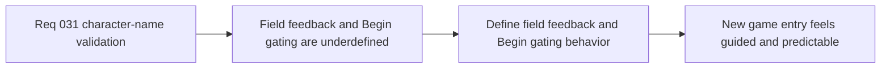

## item_116_define_character_name_field_feedback_and_begin_gating_behavior - Define character-name field feedback and Begin gating behavior
> From version: 0.2.2
> Status: Draft
> Understanding: 98%
> Confidence: 96%
> Progress: 0%
> Complexity: Low
> Theme: UX
> Reminder: Update status/understanding/confidence/progress and linked task references when you edit this doc.

# Problem
- The naming flow needs more than raw validation rules: the player also needs clear feedback, a sensible default value, and an obvious rule for when `Begin` becomes available.
- Without a dedicated feedback/gating slice, the field can become technically validated but still confusing or frustrating in moment-to-moment use.

# Scope
- In: Defining inline feedback behavior for the character-name field, the default-name posture, and the gating behavior for the `Begin` CTA.
- Out: Broader character-creation UX, post-start renaming, or cinematic onboarding redesign.

# Acceptance criteria
- AC1: The slice defines how the character-name field communicates valid and invalid states to the player.
- AC2: The slice defines whether validation happens live, on blur, or on submit, and keeps the behavior quiet enough for a first-slice UX.
- AC3: The slice defines the default-name posture used when the player first enters the flow.
- AC4: The slice defines when the `Begin` action is enabled or disabled relative to the current field state.

# AC Traceability
- AC1 -> Scope: Field feedback is explicit. Proof target: interaction note, UI state model, or implementation report.
- AC2 -> Scope: Validation timing is explicit. Proof target: field behavior or UX summary.
- AC3 -> Scope: Default-name posture is explicit. Proof target: field initialization or product note.
- AC4 -> Scope: Begin gating is explicit. Proof target: CTA state rule or implementation summary.

# Decision framing
- Product framing: Primary
- Product signals: usability and confidence
- Product follow-up: Make the first naming interaction feel deliberate without making it heavy.
- Architecture framing: Supporting
- Architecture signals: shell-owned form behavior
- Architecture follow-up: Keep field-state behavior explicit so the shell flow remains deterministic and easy to test.

# Links
- Product brief(s): `prod_001_minimal_overlay_and_feedback_for_early_runtime`
- Architecture decision(s): `adr_002_separate_react_shell_from_pixi_runtime_ownership`, `adr_016_define_shell_scene_state_and_meta_surface_ownership`
- Request: `req_031_define_character_name_validation_and_constraints_for_new_game_entry`

# Priority
- Impact: Medium
- Urgency: Medium

# Notes
- Derived from request `req_031_define_character_name_validation_and_constraints_for_new_game_entry`.
- Source file: `logics/request/req_031_define_character_name_validation_and_constraints_for_new_game_entry.md`.
