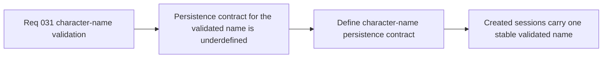

## item_117_define_character_name_persistence_contract_for_session_creation - Define character-name persistence contract for session creation
> From version: 0.5.0
> Status: Done
> Understanding: 98%
> Confidence: 96%
> Progress: 100%
> Complexity: Low
> Theme: UX
> Reminder: Update status/understanding/confidence/progress and linked task references when you edit this doc.

# Problem
- Even with a clear field contract, the character name still needs an explicit rule for how the validated value becomes part of session creation and later shell/HUD usage.
- Without a dedicated persistence slice, UI normalization can diverge from the value actually stored or displayed after `Begin`.

# Scope
- In: Defining how the validated character name is normalized, persisted, and attached to the created session for first-slice `New game`.
- Out: Full save-system redesign, post-start renaming, account-level identity, or cross-device profile sync.

# Acceptance criteria
- AC1: The slice defines how the validated character name is normalized before session creation and persistence.
- AC2: The slice defines how the stored character name becomes part of the created session contract.
- AC3: The slice defines whether the first-slice character name remains fixed after `Begin`.
- AC4: The slice remains compatible with the current shell-owned session-entry model and local-first persistence posture.

# AC Traceability
- AC1 -> Scope: Normalization before persistence is explicit. Proof target: storage rule, session contract note, or implementation report.
- AC2 -> Scope: Session-creation attachment is explicit. Proof target: session model, save payload, or behavior summary.
- AC3 -> Scope: Mutability after start is explicit. Proof target: product rule or persistence note.
- AC4 -> Scope: Existing shell-owned local-first posture remains intact. Proof target: compatibility note or behavior summary.

# Request AC Traceability
- req_031_define_character_name_validation_and_constraints_for_new_game_entry coverage: AC1, AC2, AC3, AC4, AC5, AC6, AC7. Proof: `item_117_define_character_name_persistence_contract_for_session_creation` remains the request-closing backlog slice for `req_031_define_character_name_validation_and_constraints_for_new_game_entry` and stays linked to `task_036_orchestrate_main_menu_new_game_and_character_name_entry_wave` for delivered implementation evidence.

# Decision framing
- Product framing: Primary
- Product signals: consistency and reliability
- Product follow-up: Ensure the character name the user confirms is the one the rest of the product actually carries.
- Architecture framing: Supporting
- Architecture signals: session bootstrap contract and local-first persistence
- Architecture follow-up: Keep session creation deterministic and prevent divergence between form state and stored state.

# Links
- Product brief(s): `prod_001_minimal_overlay_and_feedback_for_early_runtime`
- Architecture decision(s): `adr_002_separate_react_shell_from_pixi_runtime_ownership`, `adr_009_limit_persistence_to_local_versioned_frontend_storage`, `adr_016_define_shell_scene_state_and_meta_surface_ownership`
- Request: `req_031_define_character_name_validation_and_constraints_for_new_game_entry`

# Priority
- Impact: Medium
- Urgency: Medium

# Notes
- Derived from request `req_031_define_character_name_validation_and_constraints_for_new_game_entry`.
- Source file: `logics/request/req_031_define_character_name_validation_and_constraints_for_new_game_entry.md`.
- Delivered in `src/app/hooks/useRuntimeSession.ts` and `src/shared/lib/runtimeSessionStorage.ts`, which normalize the validated name before attaching it to the created session contract.
