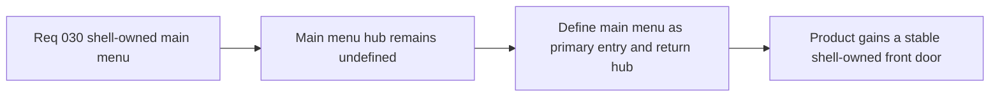

## item_118_define_a_shell_owned_main_menu_as_the_primary_product_entry_and_return_hub - Define a shell-owned main menu as the primary product entry and return hub
> From version: 0.2.2
> Status: Done
> Understanding: 98%
> Confidence: 96%
> Progress: 100%
> Complexity: Medium
> Theme: UX
> Reminder: Update status/understanding/confidence/progress and linked task references when you edit this doc.

# Problem
- The product still lacks a true shell-owned front door, so runtime start feels like a technical bootstrap instead of a deliberate game entry.
- Without a dedicated main-menu slice, boot entry and return-to-menu behavior can drift into ad hoc scene transitions rather than a stable hub.

# Scope
- In: Defining the shell-owned `Main menu` as the default boot destination and the durable return hub for the product, including its primary destinations and shell-family alignment.
- Out: Deep save-system redesign, full title-screen spectacle design, or broader combat/progression systems.

# Acceptance criteria
- AC1: The slice defines `Main menu` as the default shell-owned product entry before runtime begins.
- AC2: The slice defines the primary top-level destinations exposed by the main menu for the first slice.
- AC3: The slice defines how the main menu can be reached again from an active runtime session.
- AC4: The slice keeps the main menu aligned with the current tactical-console shell family without reopening broad visual redesign.

# AC Traceability
- AC1 -> Scope: Boot destination is explicit. Proof target: routing note, scene-flow spec, or implementation report.
- AC2 -> Scope: Main-menu destination set is explicit. Proof target: IA note, scene structure, or implementation summary.
- AC3 -> Scope: Return path from runtime is explicit. Proof target: command-deck route, shell transition note, or behavior summary.
- AC4 -> Scope: Visual family alignment is explicit. Proof target: UX note or implementation report.

# Decision framing
- Product framing: Primary
- Product signals: clarity and intentional entry
- Product follow-up: Treat `Main menu` as a real product hub, not a disposable pre-runtime overlay.
- Architecture framing: Supporting
- Architecture signals: shell-owned scene routing
- Architecture follow-up: Preserve shell/runtime ownership while giving the game one stable entry and return surface.

# Links
- Product brief(s): `prod_001_minimal_overlay_and_feedback_for_early_runtime`
- Architecture decision(s): `adr_002_separate_react_shell_from_pixi_runtime_ownership`, `adr_016_define_shell_scene_state_and_meta_surface_ownership`, `adr_025_keep_shell_chrome_event_driven_and_sample_diagnostics_off_the_runtime_hot_path`
- Request: `req_030_define_a_shell_owned_main_menu_and_new_game_entry_flow`

# Priority
- Impact: High
- Urgency: Medium

# Notes
- Derived from request `req_030_define_a_shell_owned_main_menu_and_new_game_entry_flow`.
- Source file: `logics/request/req_030_define_a_shell_owned_main_menu_and_new_game_entry_flow.md`.
- Delivered through `src/app/model/appScene.ts`, `src/app/hooks/useAppScene.ts`, `src/app/AppShell.tsx`, and `src/app/components/AppMetaScenePanel.tsx`.
