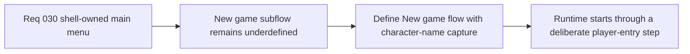

## item_119_define_a_new_game_flow_that_captures_character_name_before_runtime_start - Define a new-game flow that captures character name before runtime start
> From version: 0.2.2
> Status: Draft
> Understanding: 98%
> Confidence: 96%
> Progress: 0%
> Complexity: Medium
> Theme: UX
> Reminder: Update status/understanding/confidence/progress and linked task references when you edit this doc.

# Problem
- `New game` needs to be more than a direct jump into runtime, because the player must first confirm a minimal session-creation step with character identity.
- Without a dedicated new-game slice, character-name capture can become an inline afterthought or produce a weak transition between shell and runtime.

# Scope
- In: Defining the first `New game` subflow, including character-name capture, the lightweight first-slice form posture, and the transition from validated entry to runtime start.
- Out: Deep character creation, profile systems, party creation, or broader onboarding cinematics.

# Acceptance criteria
- AC1: The slice defines a dedicated `New game` flow rather than treating session start as an immediate runtime jump.
- AC2: The slice defines how character-name capture fits into the first-slice `New game` flow before runtime start.
- AC3: The slice defines the first-slice CTA path from validated name entry to beginning the runtime session.
- AC4: The slice keeps the flow intentionally lightweight and compatible with shell-owned scene ownership.

# AC Traceability
- AC1 -> Scope: Dedicated `New game` subflow is explicit. Proof target: scene flow, UX note, or implementation report.
- AC2 -> Scope: Character-name placement is explicit. Proof target: flow note, form model, or implementation summary.
- AC3 -> Scope: Transition from name entry to runtime start is explicit. Proof target: CTA behavior or scene-transition summary.
- AC4 -> Scope: First-slice lightness and shell ownership remain intact. Proof target: scope note or implementation report.

# Decision framing
- Product framing: Primary
- Product signals: intentional onboarding and clarity
- Product follow-up: Make `New game` feel like the beginning of a session, not a raw runtime bootstrap.
- Architecture framing: Supporting
- Architecture signals: shell-owned session-entry flow
- Architecture follow-up: Keep session creation explicit and bounded before runtime ownership transfers.

# Links
- Product brief(s): `prod_001_minimal_overlay_and_feedback_for_early_runtime`
- Architecture decision(s): `adr_002_separate_react_shell_from_pixi_runtime_ownership`, `adr_016_define_shell_scene_state_and_meta_surface_ownership`
- Request: `req_030_define_a_shell_owned_main_menu_and_new_game_entry_flow`

# Priority
- Impact: High
- Urgency: Medium

# Notes
- Derived from request `req_030_define_a_shell_owned_main_menu_and_new_game_entry_flow`.
- Source file: `logics/request/req_030_define_a_shell_owned_main_menu_and_new_game_entry_flow.md`.
