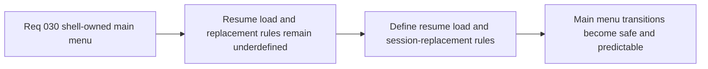

## item_120_define_resume_load_and_session_replacement_rules_for_main_menu_navigation - Define resume, load, and session-replacement rules for main-menu navigation
> From version: 0.2.2
> Status: Done
> Understanding: 98%
> Confidence: 96%
> Progress: 100%
> Complexity: Medium
> Theme: UX
> Reminder: Update status/understanding/confidence/progress and linked task references when you edit this doc.

# Problem
- A main menu is incomplete without explicit rules for `Resume`, `Load game`, and replacing an active session safely.
- Without a dedicated transition-rules slice, boot states, unavailable saves, and unsaved-session replacement behavior can become inconsistent or destructive.

# Scope
- In: Defining `Resume` availability, `Load game` availability posture, and confirmation rules when `New game` or `Load game` would replace an active unsaved session.
- Out: Full save-slot architecture redesign, multi-profile management, or deep persistence-system changes beyond the first menu behavior contract.

# Acceptance criteria
- AC1: The slice defines when `Resume` is shown or emphasized relative to current session state.
- AC2: The slice defines how `Load game` behaves when no save is available.
- AC3: The slice defines confirmation behavior when `New game` or `Load game` would replace an active unsaved session.
- AC4: The slice keeps session preservation and shell/runtime ownership explicit while avoiding destructive silent transitions.

# AC Traceability
- AC1 -> Scope: Resume availability is explicit. Proof target: menu-state rule or implementation summary.
- AC2 -> Scope: Empty save posture is explicit. Proof target: IA note, disabled-state rule, or implementation report.
- AC3 -> Scope: Replacement confirmation behavior is explicit. Proof target: confirmation rule or scene-transition summary.
- AC4 -> Scope: Safe shell/runtime transition posture is explicit. Proof target: ownership note or behavior report.

# Decision framing
- Product framing: Primary
- Product signals: safety and predictability
- Product follow-up: Make the main menu durable enough to use both at boot and mid-session without surprising the player.
- Architecture framing: Supporting
- Architecture signals: shell-owned navigation and session preservation
- Architecture follow-up: Keep transitions explicit so the preserved runtime session remains compatible with shell routing.

# Links
- Product brief(s): `prod_001_minimal_overlay_and_feedback_for_early_runtime`
- Architecture decision(s): `adr_002_separate_react_shell_from_pixi_runtime_ownership`, `adr_009_limit_persistence_to_local_versioned_frontend_storage`, `adr_016_define_shell_scene_state_and_meta_surface_ownership`
- Request: `req_030_define_a_shell_owned_main_menu_and_new_game_entry_flow`

# Priority
- Impact: High
- Urgency: Medium

# Notes
- Derived from request `req_030_define_a_shell_owned_main_menu_and_new_game_entry_flow`.
- Source file: `logics/request/req_030_define_a_shell_owned_main_menu_and_new_game_entry_flow.md`.
- Delivered with visible-but-disabled `Load game`, conditional `Resume`, and explicit replacement confirmation inside `src/app/AppShell.tsx` and `src/app/components/AppMetaScenePanel.tsx`.
