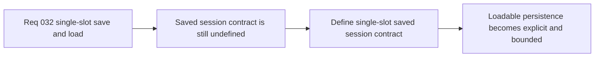

## item_121_define_a_single_slot_saved_session_contract_for_local_first_persistence - Define a single-slot saved session contract for local-first persistence
> From version: 0.2.2
> Status: Draft
> Understanding: 97%
> Confidence: 95%
> Progress: 0%
> Complexity: Medium
> Theme: UX
> Reminder: Update status/understanding/confidence/progress and linked task references when you edit this doc.

# Problem
- The shell now has a real main menu and resumable active session, but there is still no durable saved-session contract behind `Load game`.
- Without an explicit single-slot persistence contract, save/load behavior can drift into ad hoc storage writes and ambiguous state restoration.

# Scope
- In: Defining the first persisted saved-session payload and metadata contract for one local-first save slot, including compatibility with the current browser-storage posture.
- Out: Multi-slot save browsing, cloud sync, account/profile systems, or broad progression redesign beyond what first-slice save durability requires.

# Acceptance criteria
- AC1: The slice defines what the single saved slot contains strongly enough to guide implementation.
- AC2: The slice defines the minimal metadata needed to make the saved slot player-facing and understandable.
- AC3: The slice stays compatible with the current local-first browser-storage posture.
- AC4: The slice keeps persistence bounded to one slot without reopening multi-slot scope.

# AC Traceability
- AC1 -> Scope: Saved payload is explicit. Proof target: storage contract, schema note, or implementation report.
- AC2 -> Scope: Save metadata is explicit. Proof target: field list, UX note, or behavior summary.
- AC3 -> Scope: Local-first posture remains intact. Proof target: compatibility note or storage summary.
- AC4 -> Scope: Single-slot boundary is explicit. Proof target: persistence rule or implementation note.

# Decision framing
- Product framing: Primary
- Product signals: durability and trust
- Product follow-up: Make `Load game` feel real by grounding it in one explicit saved-session contract.
- Architecture framing: Supporting
- Architecture signals: local-first bounded persistence
- Architecture follow-up: Keep saved-session shape explicit before UI behavior grows around it.

# Links
- Product brief(s): `prod_001_minimal_overlay_and_feedback_for_early_runtime`
- Architecture decision(s): `adr_009_limit_persistence_to_local_versioned_frontend_storage`, `adr_016_define_shell_scene_state_and_meta_surface_ownership`
- Request: `req_032_define_a_single_slot_save_and_load_flow_for_shell_owned_session_entry`

# Priority
- Impact: High
- Urgency: Medium

# Notes
- Derived from request `req_032_define_a_single_slot_save_and_load_flow_for_shell_owned_session_entry`.
- Source file: `logics/request/req_032_define_a_single_slot_save_and_load_flow_for_shell_owned_session_entry.md`.
