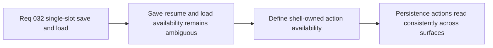

## item_122_define_save_resume_and_load_availability_across_shell_owned_surfaces - Define save, resume, and load availability across shell-owned surfaces
> From version: 0.2.2
> Status: Draft
> Understanding: 97%
> Confidence: 95%
> Progress: 0%
> Complexity: Medium
> Theme: UX
> Reminder: Update status/understanding/confidence/progress and linked task references when you edit this doc.

# Problem
- Even with a saved-session contract, the product remains unclear until `Save`, `Resume`, and `Load game` availability are explicit across the shell-owned surfaces.
- Without a dedicated availability slice, the menu and main-menu affordances can drift and make persistence feel inconsistent or unsafe.

# Scope
- In: Defining when `Save`, `Resume`, and `Load game` are visible, enabled, or unavailable across the current shell-owned surfaces for the single-slot model.
- Out: Multi-slot UX, autosave policy, or broad shell-menu redesign beyond the availability rules needed for save/load clarity.

# Acceptance criteria
- AC1: The slice defines when `Resume` is available versus when `Load game` is available.
- AC2: The slice defines where `Save` is exposed in the first slice.
- AC3: The slice defines how unavailable `Load game` is presented when no saved slot exists.
- AC4: The slice keeps availability rules aligned with the current shell-owned main-menu and command-deck posture.

# AC Traceability
- AC1 -> Scope: Resume/load distinction is explicit. Proof target: availability matrix, UI behavior note, or implementation report.
- AC2 -> Scope: Save entry point is explicit. Proof target: shell IA note or behavior summary.
- AC3 -> Scope: No-save behavior is explicit. Proof target: UI state note or implementation summary.
- AC4 -> Scope: Existing shell posture remains aligned. Proof target: shell-surface compatibility note.

# Decision framing
- Product framing: Primary
- Product signals: clarity and confidence
- Product follow-up: Keep persistence actions understandable without requiring players to infer hidden state.
- Architecture framing: Supporting
- Architecture signals: shell-owned availability rules
- Architecture follow-up: Keep persistence behavior explicit across the menu family.

# Links
- Product brief(s): `prod_001_minimal_overlay_and_feedback_for_early_runtime`
- Architecture decision(s): `adr_016_define_shell_scene_state_and_meta_surface_ownership`, `adr_022_keep_product_meta_flow_shell_owned_while_runtime_state_remains_game_preserved`
- Request: `req_032_define_a_single_slot_save_and_load_flow_for_shell_owned_session_entry`

# Priority
- Impact: High
- Urgency: Medium

# Notes
- Derived from request `req_032_define_a_single_slot_save_and_load_flow_for_shell_owned_session_entry`.
- Source file: `logics/request/req_032_define_a_single_slot_save_and_load_flow_for_shell_owned_session_entry.md`.
