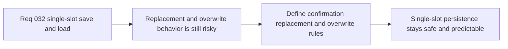

## item_123_define_active_session_replacement_and_overwrite_rules_for_single_slot_save_load - Define active-session replacement and overwrite rules for single-slot save/load
> From version: 0.5.0
> Status: Done
> Understanding: 100%
> Confidence: 97%
> Progress: 100%
> Complexity: Medium
> Theme: UX
> Reminder: Update status/understanding/confidence/progress and linked task references when you edit this doc.

# Problem
- The shell already allows `New game` and `Resume`, but `Load game` and `Save` will create replacement and overwrite moments that need explicit rules.
- Without a dedicated replacement/overwrite slice, persistence actions can become destructive or inconsistent when a meaningful active session already exists.

# Scope
- In: Defining confirmation, replacement, and overwrite rules for loading, saving, and starting a new game in the single-slot model.
- Out: Broad autosave policy, rollback/version history, or multi-slot conflict management.

# Acceptance criteria
- AC1: The slice defines when loading a saved session must confirm replacement of active state.
- AC2: The slice defines how saving overwrites the single slot in the first slice.
- AC3: The slice defines how `New game` interacts with existing active and saved state.
- AC4: The slice keeps the model simple and deterministic without reopening history, rollback, or multi-slot behavior.

# AC Traceability
- AC1 -> Scope: Load replacement posture is explicit. Proof target: confirmation rule or behavior summary.
- AC2 -> Scope: Save overwrite posture is explicit. Proof target: save interaction note or implementation report.
- AC3 -> Scope: New-game replacement posture is explicit. Proof target: transition rule or UI flow summary.
- AC4 -> Scope: Single-slot simplicity remains intact. Proof target: bounded-flow note or implementation summary.

# Request AC Traceability
- req_032_define_a_single_slot_save_and_load_flow_for_shell_owned_session_entry coverage: AC1, AC2, AC3, AC4, AC5, AC6. Proof: `item_123_define_active_session_replacement_and_overwrite_rules_for_single_slot_save_load` remains the request-closing backlog slice for `req_032_define_a_single_slot_save_and_load_flow_for_shell_owned_session_entry` and stays linked to `task_037_orchestrate_single_slot_persistence_and_pseudo_physics_foundations` for delivered implementation evidence.

# Decision framing
- Product framing: Primary
- Product signals: safety and recoverability
- Product follow-up: Make single-slot persistence trustworthy before deepening save UX.
- Architecture framing: Supporting
- Architecture signals: explicit shell transition rules
- Architecture follow-up: Keep replacement semantics codified rather than emergent.

# Links
- Product brief(s): `prod_001_minimal_overlay_and_feedback_for_early_runtime`
- Architecture decision(s): `adr_009_limit_persistence_to_local_versioned_frontend_storage`, `adr_016_define_shell_scene_state_and_meta_surface_ownership`, `adr_022_keep_product_meta_flow_shell_owned_while_runtime_state_remains_game_preserved`
- Request: `req_032_define_a_single_slot_save_and_load_flow_for_shell_owned_session_entry`

# Priority
- Impact: High
- Urgency: Medium

# Notes
- Derived from request `req_032_define_a_single_slot_save_and_load_flow_for_shell_owned_session_entry`.
- Source file: `logics/request/req_032_define_a_single_slot_save_and_load_flow_for_shell_owned_session_entry.md`.
- Delivered through `src/app/AppShell.tsx` and `src/app/hooks/useRuntimeSession.ts`, with direct single-slot overwrite on save, explicit replacement when loading into the active session, and preserved `New game` replacement safeguards carried forward from the main-menu wave.
