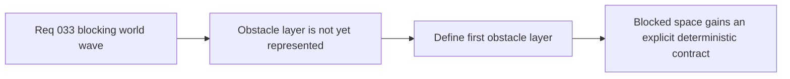

## item_124_define_a_first_obstacle_layer_representation_for_runtime_traversal - Define a first obstacle-layer representation for runtime traversal
> From version: 0.2.2
> Status: Done
> Understanding: 100%
> Confidence: 98%
> Progress: 100%
> Complexity: Medium
> Theme: Gameplay
> Reminder: Update status/understanding/confidence/progress and linked task references when you edit this doc.

# Problem
- The generated world is still terrain-first, so blocked space has no explicit representation independent from visual terrain identity.
- Without a dedicated obstacle-layer slice, traversal blocking risks being inferred ad hoc from terrain kinds and collapsing visual and gameplay concerns together.

# Scope
- In: Defining the first obstacle-layer contract above terrain generation strongly enough to represent blocked world space deterministically.
- Out: Full authoring tooling, hazard systems, or broad world-interaction redesign beyond first-slice blocking representation.

# Acceptance criteria
- AC1: The slice defines how blocking world space is represented separately from visual terrain.
- AC2: The slice defines how the obstacle layer composes with deterministic world generation.
- AC3: The slice keeps the first obstacle representation intentionally narrow enough for first-slice runtime traversal.
- AC4: The slice remains compatible with future richer obstacle types without requiring them immediately.

# AC Traceability
- AC1 -> Scope: Terrain/obstacle separation is explicit. Proof target: data model note or implementation report.
- AC2 -> Scope: Deterministic generation posture is explicit. Proof target: generation rule or behavior summary.
- AC3 -> Scope: First-slice narrowness is explicit. Proof target: bounded contract note.
- AC4 -> Scope: Future extension remains possible. Proof target: compatibility note or follow-up guidance.

# Decision framing
- Product framing: Primary
- Product signals: credible blocked space
- Product follow-up: Give the world solid areas without turning terrain labels into hidden collision rules.
- Architecture framing: Primary
- Architecture signals: layered world representation
- Architecture follow-up: Preserve the new terrain/obstacle separation before collision logic grows around it.

# Links
- Product brief(s): `prod_001_minimal_overlay_and_feedback_for_early_runtime`
- Architecture decision(s): `adr_032_separate_visual_terrain_blocking_obstacles_and_movement_surface_modifiers`, `adr_033_adopt_deterministic_movement_oriented_pseudo_physics_instead_of_a_full_physics_engine`
- Request: `req_033_define_a_first_collision_and_blocking_world_wave_for_runtime_gameplay`

# Priority
- Impact: High
- Urgency: Medium

# Notes
- Derived from request `req_033_define_a_first_collision_and_blocking_world_wave_for_runtime_gameplay`.
- Source file: `logics/request/req_033_define_a_first_collision_and_blocking_world_wave_for_runtime_gameplay.md`.
- Delivered through `games/emberwake/src/content/world/worldData.ts`, `games/emberwake/src/content/world/worldGeneration.ts`, `src/game/world/model/worldGeneration.ts`, and `games/emberwake/src/content/world/chunkDebugData.ts`.
