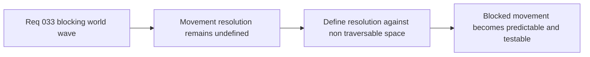

## item_125_define_movement_resolution_against_non_traversable_world_space - Define movement resolution against non-traversable world space
> From version: 0.2.2
> Status: Draft
> Understanding: 97%
> Confidence: 95%
> Progress: 0%
> Complexity: Medium
> Theme: Gameplay
> Reminder: Update status/understanding/confidence/progress and linked task references when you edit this doc.

# Problem
- Even with an obstacle layer, the runtime still needs a clear rule for how attempted movement resolves against blocked world space.
- Without a dedicated movement-resolution slice, collision behavior can drift between full blocking, partial sliding, or inconsistent per-entity hacks.

# Scope
- In: Defining first-slice movement resolution against non-traversable world space in a deterministic, fixed-step-compatible way.
- Out: Full physics response, broad navmesh/pathfinding redesign, or continuous collision systems beyond current movement needs.

# Acceptance criteria
- AC1: The slice defines how attempted movement resolves when it meets blocked world space.
- AC2: The slice keeps resolution deterministic and compatible with the fixed-step runtime posture.
- AC3: The slice defines whether first-slice behavior is full blocking, axis-aware sliding, or another bounded alternative.
- AC4: The slice stays focused on world-blocking movement rather than reopening full physical simulation.

# AC Traceability
- AC1 -> Scope: Movement resolution is explicit. Proof target: collision rule or implementation report.
- AC2 -> Scope: Determinism posture is explicit. Proof target: simulation note or test summary.
- AC3 -> Scope: Resolution strategy is explicit. Proof target: movement semantics note.
- AC4 -> Scope: Physics scope remains bounded. Proof target: out-of-scope compatibility note.

# Decision framing
- Product framing: Primary
- Product signals: movement credibility
- Product follow-up: Make blocked terrain feel deliberate rather than buggy or arbitrary.
- Architecture framing: Supporting
- Architecture signals: fixed-step deterministic resolution
- Architecture follow-up: Keep world collision simple and explicit before more systems depend on it.

# Links
- Product brief(s): `prod_001_minimal_overlay_and_feedback_for_early_runtime`
- Architecture decision(s): `adr_033_adopt_deterministic_movement_oriented_pseudo_physics_instead_of_a_full_physics_engine`
- Request: `req_033_define_a_first_collision_and_blocking_world_wave_for_runtime_gameplay`

# Priority
- Impact: High
- Urgency: Medium

# Notes
- Derived from request `req_033_define_a_first_collision_and_blocking_world_wave_for_runtime_gameplay`.
- Source file: `logics/request/req_033_define_a_first_collision_and_blocking_world_wave_for_runtime_gameplay.md`.
