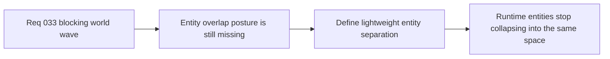

## item_126_define_a_lightweight_entity_separation_posture_for_runtime_collisions - Define a lightweight entity separation posture for runtime collisions
> From version: 0.2.2
> Status: Draft
> Understanding: 97%
> Confidence: 95%
> Progress: 0%
> Complexity: Medium
> Theme: Gameplay
> Reminder: Update status/understanding/confidence/progress and linked task references when you edit this doc.

# Problem
- Once blocked world space exists, entity overlap becomes more visibly broken and needs an explicit first-slice response.
- Without a dedicated entity-separation slice, overlap prevention risks being postponed or implemented through unstable one-off rules.

# Scope
- In: Defining first-slice entity/entity overlap prevention and lightweight separation for relevant runtime entities.
- Out: Full rigid-body response, crowd simulation, projectile collision redesign, or making every runtime object collidable immediately.

# Acceptance criteria
- AC1: The slice defines a first entity/entity overlap-prevention posture for the runtime.
- AC2: The slice keeps entity collision intentionally lightweight and non-physical.
- AC3: The slice defines the first relevant collidable-entity scope strongly enough to guide implementation.
- AC4: The slice stays compatible with the current deterministic fixed-step runtime posture.

# AC Traceability
- AC1 -> Scope: Overlap-prevention posture is explicit. Proof target: collision note or implementation report.
- AC2 -> Scope: Lightweight response is explicit. Proof target: response semantics note.
- AC3 -> Scope: First collidable set is explicit. Proof target: scope note or runtime contract summary.
- AC4 -> Scope: Deterministic runtime compatibility is explicit. Proof target: simulation note or test summary.

# Decision framing
- Product framing: Primary
- Product signals: spatial credibility
- Product follow-up: Keep entities readable and separate once world solidity becomes meaningful.
- Architecture framing: Supporting
- Architecture signals: deterministic entity separation
- Architecture follow-up: Preserve the pseudo-physics posture instead of drifting toward rigid-body response.

# Links
- Product brief(s): `prod_001_minimal_overlay_and_feedback_for_early_runtime`
- Architecture decision(s): `adr_033_adopt_deterministic_movement_oriented_pseudo_physics_instead_of_a_full_physics_engine`, `adr_035_resolve_entity_collisions_as_lightweight_deterministic_separation`
- Request: `req_033_define_a_first_collision_and_blocking_world_wave_for_runtime_gameplay`

# Priority
- Impact: Medium
- Urgency: Medium

# Notes
- Derived from request `req_033_define_a_first_collision_and_blocking_world_wave_for_runtime_gameplay`.
- Source file: `logics/request/req_033_define_a_first_collision_and_blocking_world_wave_for_runtime_gameplay.md`.
