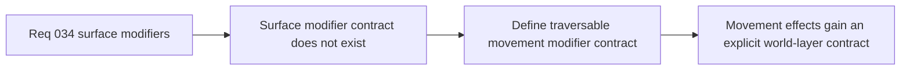

## item_127_define_a_first_movement_surface_modifier_contract_for_traversable_world_space - Define a first movement surface modifier contract for traversable world space
> From version: 0.2.2
> Status: Done
> Understanding: 100%
> Confidence: 97%
> Progress: 100%
> Complexity: Medium
> Theme: Gameplay
> Reminder: Update status/understanding/confidence/progress and linked task references when you edit this doc.

# Problem
- The runtime currently lacks a dedicated contract for traversable surfaces that affect movement without blocking it.
- Without a first surface-modifier slice, effects such as `slow` or `slippery` risk being buried inside terrain labels or obstacle rules.

# Scope
- In: Defining the first movement-surface modifier contract for traversable world space, with clear separation from terrain identity and obstacle blocking.
- Out: Full material systems, hazards, status effects, or broad traversal redesign beyond first-slice movement modifiers.

# Acceptance criteria
- AC1: The slice defines a dedicated first-slice movement-surface modifier contract for traversable space.
- AC2: The slice keeps the modifier layer distinct from both terrain identity and obstacle blocking.
- AC3: The slice stays intentionally narrow enough for first-slice traversal effects.
- AC4: The slice remains compatible with deterministic world generation and fixed-step runtime use.

# AC Traceability
- AC1 -> Scope: Modifier contract is explicit. Proof target: enum/schema note or implementation report.
- AC2 -> Scope: Layer separation is explicit. Proof target: architecture note or data model summary.
- AC3 -> Scope: First-slice narrowness is explicit. Proof target: bounded contract note.
- AC4 -> Scope: Deterministic compatibility is explicit. Proof target: generation or simulation summary.

# Decision framing
- Product framing: Primary
- Product signals: traversal texture
- Product follow-up: Make walkable space feel different without turning every difference into a wall.
- Architecture framing: Primary
- Architecture signals: layered traversal rules
- Architecture follow-up: Preserve the new surface-modifier layer before specific effects accumulate.

# Links
- Product brief(s): `prod_001_minimal_overlay_and_feedback_for_early_runtime`
- Architecture decision(s): `adr_032_separate_visual_terrain_blocking_obstacles_and_movement_surface_modifiers`, `adr_034_model_traversable_surface_effects_as_bounded_movement_modifiers`
- Request: `req_034_define_a_first_movement_surface_modifiers_wave_for_runtime_gameplay`

# Priority
- Impact: Medium
- Urgency: Medium

# Notes
- Derived from request `req_034_define_a_first_movement_surface_modifiers_wave_for_runtime_gameplay`.
- Source file: `logics/request/req_034_define_a_first_movement_surface_modifiers_wave_for_runtime_gameplay.md`.
- Delivered through `games/emberwake/src/content/world/worldData.ts`, `games/emberwake/src/content/world/worldGeneration.ts`, and `src/game/world/model/worldGeneration.ts`.
