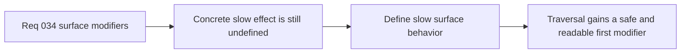

## item_128_define_slow_surface_behavior_for_fixed_step_runtime_movement - Define slow-surface behavior for fixed-step runtime movement
> From version: 0.2.2
> Status: Done
> Understanding: 100%
> Confidence: 97%
> Progress: 100%
> Complexity: Medium
> Theme: Gameplay
> Reminder: Update status/understanding/confidence/progress and linked task references when you edit this doc.

# Problem
- A movement-surface layer only becomes product-meaningful once at least one concrete traversable effect is defined.
- Without a first safe effect such as `slow`, surface modifiers risk staying abstract and delaying usable traversal variety.

# Scope
- In: Defining first-slice `slow` traversal semantics for the fixed-step runtime and how the effect should read to the player.
- Out: Full material tuning systems, stamina systems, or broad traversal-balance redesign.

# Acceptance criteria
- AC1: The slice defines how `slow` affects fixed-step runtime movement strongly enough to guide implementation.
- AC2: The slice keeps `slow` readable to the player rather than physically overcomplicated.
- AC3: The slice remains compatible with traversable-space semantics and does not drift into blocking collision.
- AC4: The slice stays narrow enough to serve as the first modifier baseline.

# AC Traceability
- AC1 -> Scope: Slow semantics are explicit. Proof target: movement rule or implementation report.
- AC2 -> Scope: Readability posture is explicit. Proof target: UX note or runtime behavior summary.
- AC3 -> Scope: Traversable-only semantics are explicit. Proof target: layer compatibility note.
- AC4 -> Scope: Baseline narrowness is explicit. Proof target: bounded-effect note.

# Decision framing
- Product framing: Primary
- Product signals: readable traversal difference
- Product follow-up: Ship the safest useful movement modifier before pursuing more expressive effects.
- Architecture framing: Supporting
- Architecture signals: bounded modifier semantics
- Architecture follow-up: Use `slow` as the anchor effect for validating the movement-surface layer.

# Links
- Product brief(s): `prod_001_minimal_overlay_and_feedback_for_early_runtime`
- Architecture decision(s): `adr_033_adopt_deterministic_movement_oriented_pseudo_physics_instead_of_a_full_physics_engine`, `adr_034_model_traversable_surface_effects_as_bounded_movement_modifiers`
- Request: `req_034_define_a_first_movement_surface_modifiers_wave_for_runtime_gameplay`

# Priority
- Impact: Medium
- Urgency: Medium

# Notes
- Derived from request `req_034_define_a_first_movement_surface_modifiers_wave_for_runtime_gameplay`.
- Source file: `logics/request/req_034_define_a_first_movement_surface_modifiers_wave_for_runtime_gameplay.md`.
- Delivered through `games/emberwake/src/content/world/worldData.ts`, `games/emberwake/src/runtime/pseudoPhysics.ts`, and `games/emberwake/src/runtime/pseudoPhysics.test.ts`, with `slow` implemented as a bounded speed multiplier on traversable space.
