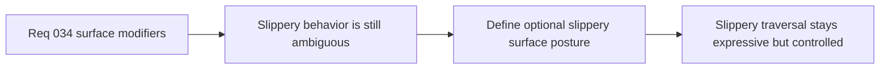

## item_129_define_optional_slippery_surface_behavior_without_reopening_full_physics_scope - Define optional slippery-surface behavior without reopening full physics scope
> From version: 0.5.0
> Status: Done
> Understanding: 100%
> Confidence: 96%
> Progress: 100%
> Complexity: Medium
> Theme: Gameplay
> Reminder: Update status/understanding/confidence/progress and linked task references when you edit this doc.

# Problem
- `Slippery` is a compelling traversal effect, but it can quickly blur into uncontrolled pseudo-physics if not bounded explicitly.
- Without a dedicated slippery-surface slice, the runtime risks either shipping an unreadable control-loss effect or avoiding the feature altogether.

# Scope
- In: Defining a bounded first-slice `slippery` posture that remains compatible with deterministic movement and avoids reopening full physics scope.
- Out: Rich material simulation, drifting/vehicle systems, or chaotic control-loss mechanics that exceed the current movement model.

# Acceptance criteria
- AC1: The slice defines a bounded first-slice slippery-surface behavior strongly enough to guide implementation if the effect ships.
- AC2: The slice keeps slippery behavior compatible with deterministic fixed-step movement.
- AC3: The slice avoids reopening force-based or full-physics semantics.
- AC4: The slice treats readability and control retention as primary constraints.

# AC Traceability
- AC1 -> Scope: Slippery posture is explicit. Proof target: effect semantics note or implementation report.
- AC2 -> Scope: Deterministic compatibility is explicit. Proof target: simulation note or test summary.
- AC3 -> Scope: Physics scope remains bounded. Proof target: architectural compatibility note.
- AC4 -> Scope: Readability-first posture is explicit. Proof target: UX note or effect rationale.

# Request AC Traceability
- req_034_define_a_first_movement_surface_modifiers_wave_for_runtime_gameplay coverage: AC1, AC2, AC3, AC4, AC5, AC6. Proof: `item_129_define_optional_slippery_surface_behavior_without_reopening_full_physics_scope` remains the request-closing backlog slice for `req_034_define_a_first_movement_surface_modifiers_wave_for_runtime_gameplay` and stays linked to `task_037_orchestrate_single_slot_persistence_and_pseudo_physics_foundations` for delivered implementation evidence.

# Decision framing
- Product framing: Primary
- Product signals: expressive traversal
- Product follow-up: Add slippery traversal only if it strengthens the runtime instead of making movement feel arbitrary.
- Architecture framing: Supporting
- Architecture signals: bounded pseudo-physics
- Architecture follow-up: Keep slippery semantics subordinate to the deterministic movement model.

# Links
- Product brief(s): `prod_001_minimal_overlay_and_feedback_for_early_runtime`
- Architecture decision(s): `adr_033_adopt_deterministic_movement_oriented_pseudo_physics_instead_of_a_full_physics_engine`, `adr_034_model_traversable_surface_effects_as_bounded_movement_modifiers`
- Request: `req_034_define_a_first_movement_surface_modifiers_wave_for_runtime_gameplay`

# Priority
- Impact: Medium
- Urgency: Low

# Notes
- Derived from request `req_034_define_a_first_movement_surface_modifiers_wave_for_runtime_gameplay`.
- Source file: `logics/request/req_034_define_a_first_movement_surface_modifiers_wave_for_runtime_gameplay.md`.
- Delivered through `games/emberwake/src/content/world/worldData.ts`, `games/emberwake/src/runtime/pseudoPhysics.ts`, and `games/emberwake/src/runtime/pseudoPhysics.test.ts`, with `slippery` shipped as a mild inertia-preserving modifier that stays inside the deterministic pseudo-physics posture.
