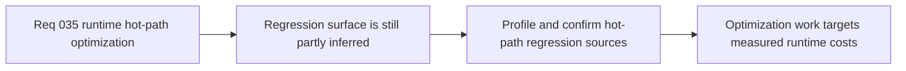

## item_130_profile_and_confirm_runtime_hot_path_regression_sources_after_pseudo_physics_wave - Profile and confirm runtime hot-path regression sources after the pseudo-physics wave
> From version: 0.2.3
> Status: Done
> Understanding: 100%
> Confidence: 100%
> Progress: 100%
> Complexity: Medium
> Theme: Performance
> Reminder: Update status/understanding/confidence/progress and linked task references when you edit this doc.

# Problem
- Runtime feel now suggests that lower FPS may reduce real entity travel distance per second instead of only reducing visual smoothness.
- Without a dedicated profiling and confirmation slice, optimization work risks targeting generic code cleanup instead of the actual hot-path sources behind the movement slowdown symptom.

# Scope
- In: Profiling and confirming the credible runtime hot-path regression sources introduced or amplified by obstacle queries, surface modifiers, fixed-step catch-up saturation, and repeated stable work.
- Out: Broad rendering optimization, unrelated cleanup, or speculative architectural rewrites before the regression surface is confirmed.

# Acceptance criteria
- AC1: The slice defines how to confirm whether lower-FPS movement slowdown is caused by simulation throughput loss rather than only by visual jitter.
- AC2: The slice defines at least one profiling or measurement target for repeated world queries inside the fixed-step loop.
- AC3: The slice defines at least one profiling or measurement target for catch-up saturation around `maxCatchUpStepsPerFrame`.
- AC4: The slice keeps the investigation bounded to credible hot-path sources and does not turn into a generic performance audit.

# AC Traceability
- AC1 -> Scope: Movement-slowdown symptom is measurable. Proof target: profiling note, runtime metrics plan, or implementation report.
- AC2 -> Scope: World-query hotspot is measurable. Proof target: sampling metrics note or profiling summary.
- AC3 -> Scope: Catch-up saturation is measurable. Proof target: frame-loop metrics note or runtime report.
- AC4 -> Scope: Investigation remains bounded. Proof target: scope note or implementation summary.

# Decision framing
- Product framing: Primary
- Product signals: trustworthy movement speed under load
- Product follow-up: Confirm whether the player-facing slowdown is a real-time simulation issue before optimizing blindly.
- Architecture framing: Supporting
- Architecture signals: fixed-step runtime observability
- Architecture follow-up: Use evidence to decide whether hot-path work, catch-up policy, or both need intervention.

# Links
- Product brief(s): `prod_001_minimal_overlay_and_feedback_for_early_runtime`
- Architecture decision(s): `adr_033_adopt_deterministic_movement_oriented_pseudo_physics_instead_of_a_full_physics_engine`
- Request: `req_035_define_a_runtime_hot_path_optimization_wave_for_pseudo_physics_and_world_queries`

# Priority
- Impact: High
- Urgency: High

# Notes
- Derived from request `req_035_define_a_runtime_hot_path_optimization_wave_for_pseudo_physics_and_world_queries`.
- Source file: `logics/request/req_035_define_a_runtime_hot_path_optimization_wave_for_pseudo_physics_and_world_queries.md`.
- Delivered in commit `30bfe61`.
- Runtime telemetry now distinguishes:
  - dropped frame time caused by the `fixedStep * 4` clamp
  - dropped simulation debt caused by accumulator saturation under higher catch-up pressure
- The diagnostics panel and browser telemetry now expose both signals so low-FPS movement slowdown can be confirmed from runtime data instead of guesswork.
