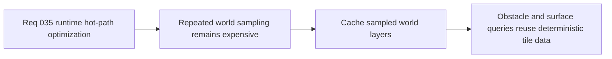

## item_131_cache_sampled_world_layers_for_deterministic_obstacle_and_surface_queries - Cache sampled world layers for deterministic obstacle and surface queries
> From version: 0.2.3
> Status: Done
> Understanding: 100%
> Confidence: 100%
> Progress: 100%
> Complexity: Medium
> Theme: Performance
> Reminder: Update status/understanding/confidence/progress and linked task references when you edit this doc.

# Problem
- The runtime currently recomputes deterministic terrain, obstacle, and surface samples repeatedly for nearby tiles during movement and collision checks.
- Without a dedicated caching slice, the layered world model remains correct but more expensive than necessary inside the fixed-step hot path.

# Scope
- In: Defining a bounded cache or reuse strategy for sampled world tile layers so obstacle and surface queries can share the same deterministic lookup results.
- Out: Broad world-generation redesign, cross-session persistence of cache data, or collapsing terrain/obstacle/surface layers back into a single representation.

# Acceptance criteria
- AC1: The slice defines a bounded cache or reuse posture for sampled world tile layers strongly enough to guide implementation.
- AC2: The slice preserves deterministic world semantics while reducing repeated obstacle and surface query work.
- AC3: The slice defines how obstacle and surface checks can reuse one combined sampled tile result where appropriate.
- AC4: The slice avoids collapsing the current terrain, obstacle, and movement-surface separation.

# AC Traceability
- AC1 -> Scope: Cache posture is explicit. Proof target: runtime query contract or implementation report.
- AC2 -> Scope: Deterministic compatibility is explicit. Proof target: world-sampling note or test summary.
- AC3 -> Scope: Query reuse is explicit. Proof target: implementation note or profiling summary.
- AC4 -> Scope: Layer separation remains intact. Proof target: architecture compatibility note.

# Decision framing
- Product framing: Supporting
- Product signals: smoother movement under load
- Product follow-up: Keep gameplay semantics intact while reducing invisible runtime overhead.
- Architecture framing: Primary
- Architecture signals: efficient layered world querying
- Architecture follow-up: Optimize the layered model without abandoning it.

# Links
- Product brief(s): `prod_001_minimal_overlay_and_feedback_for_early_runtime`
- Architecture decision(s): `adr_032_separate_visual_terrain_blocking_obstacles_and_movement_surface_modifiers`, `adr_033_adopt_deterministic_movement_oriented_pseudo_physics_instead_of_a_full_physics_engine`, `adr_034_model_traversable_surface_effects_as_bounded_movement_modifiers`
- Request: `req_035_define_a_runtime_hot_path_optimization_wave_for_pseudo_physics_and_world_queries`

# Priority
- Impact: High
- Urgency: High

# Notes
- Derived from request `req_035_define_a_runtime_hot_path_optimization_wave_for_pseudo_physics_and_world_queries`.
- Source file: `logics/request/req_035_define_a_runtime_hot_path_optimization_wave_for_pseudo_physics_and_world_queries.md`.
- Delivered in commit `3afe763`.
- `sampleWorldTileLayers()` now uses a bounded cache keyed by seed and world tile coordinate, so obstacle and surface queries reuse one deterministic sample.
- Test coverage now confirms both reuse for repeated queries and bounded cache growth.
