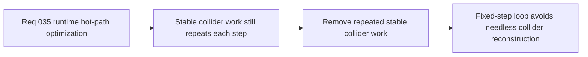

## item_132_remove_repeated_stable_collider_work_from_the_fixed_step_runtime_loop - Remove repeated stable collider work from the fixed-step runtime loop
> From version: 0.2.3
> Status: Done
> Understanding: 100%
> Confidence: 100%
> Progress: 100%
> Complexity: Medium
> Theme: Performance
> Reminder: Update status/understanding/confidence/progress and linked task references when you edit this doc.

# Problem
- The runtime still reconstructs stable support-collider inputs inside the fixed-step loop even though those colliders do not materially change frame to frame.
- Without a dedicated slice for stable collider work, the runtime keeps paying avoidable per-step cost before the more complex query optimizations even begin to help.

# Scope
- In: Defining how stable runtime support colliders should be memoized, precomputed, or otherwise removed from repeated fixed-step reconstruction.
- Out: Broad collision redesign, dynamic broadphase systems, or changing which entities are considered collidable in this wave.

# Acceptance criteria
- AC1: The slice defines how stable support colliders should be removed from repeated fixed-step reconstruction.
- AC2: The slice preserves existing collision semantics while reducing avoidable per-step work.
- AC3: The slice remains compatible with deterministic simulation and current collidable-entity posture.
- AC4: The slice stays focused on stable-input reuse rather than reopening broad collision-system redesign.

# AC Traceability
- AC1 -> Scope: Stable collider reuse posture is explicit. Proof target: implementation note or runtime contract summary.
- AC2 -> Scope: Collision semantics remain intact. Proof target: behavior summary or regression test note.
- AC3 -> Scope: Deterministic compatibility is explicit. Proof target: simulation note or runtime summary.
- AC4 -> Scope: Optimization remains bounded. Proof target: scope note or implementation report.

# Decision framing
- Product framing: Supporting
- Product signals: less slowdown under pressure
- Product follow-up: Remove obvious hot-path waste before pursuing broader optimization strategies.
- Architecture framing: Primary
- Architecture signals: stable-input reuse in deterministic simulation
- Architecture follow-up: Keep collision data disciplined and cheap in the fixed-step loop.

# Links
- Product brief(s): `prod_001_minimal_overlay_and_feedback_for_early_runtime`
- Architecture decision(s): `adr_033_adopt_deterministic_movement_oriented_pseudo_physics_instead_of_a_full_physics_engine`, `adr_035_resolve_entity_collisions_as_lightweight_deterministic_separation`
- Request: `req_035_define_a_runtime_hot_path_optimization_wave_for_pseudo_physics_and_world_queries`

# Priority
- Impact: Medium
- Urgency: High

# Notes
- Derived from request `req_035_define_a_runtime_hot_path_optimization_wave_for_pseudo_physics_and_world_queries`.
- Source file: `logics/request/req_035_define_a_runtime_hot_path_optimization_wave_for_pseudo_physics_and_world_queries.md`.
- Delivered in commit `34beb5b`.
- Stable support colliders are now built once at bootstrap and reused in the fixed-step loop.
- The previous `create...` export remains available as a compatibility alias, but it now returns the stable bootstrap-backed collider set instead of reconstructing fresh entities.
