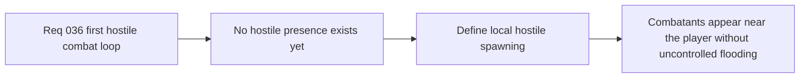

## item_133_define_hostile_spawning_near_the_player_chunk_with_a_local_population_cap - Define hostile spawning near the player chunk with a local population cap
> From version: 0.2.3
> Status: Draft
> Understanding: 100%
> Confidence: 97%
> Progress: 0%
> Complexity: Medium
> Theme: Gameplay
> Reminder: Update status/understanding/confidence/progress and linked task references when you edit this doc.

# Problem
- The runtime currently has no hostile population, so the first combat loop cannot exist even if damage and attacks are added later.
- Without a bounded spawn slice, enemies may either never appear or appear in an uncontrolled way that obscures the first combat read.

# Scope
- In: defining a first hostile spawn posture near the player chunk or immediate vicinity, with a bounded local population cap and a safe spawn distance from the player.
- Out: full encounter direction, biome-specific enemy tables, wave scripting, or global population simulation.

# Acceptance criteria
- AC1: The slice defines a bounded hostile spawn posture near the player chunk strongly enough to guide implementation.
- AC2: The slice defines a local hostile population cap for the first combat loop.
- AC3: The slice defines a safe spawn distance so hostiles do not appear directly on top of the player.
- AC4: The slice keeps the first implementation free of global wave-direction or encounter-authoring complexity.

# Links
- Request: `req_036_define_a_first_hostile_combat_loop_with_spawns_contact_damage_and_player_cone_attack`

# Notes
- Derived from request `req_036_define_a_first_hostile_combat_loop_with_spawns_contact_damage_and_player_cone_attack`.
