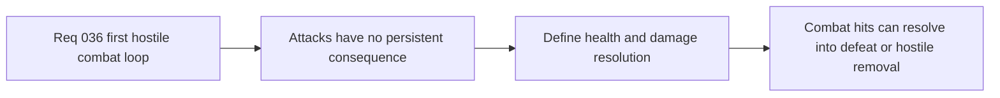

## item_134_define_shared_entity_health_and_damage_resolution_for_first_combatants - Define shared entity health and damage resolution for first combatants
> From version: 0.2.3
> Status: Draft
> Understanding: 100%
> Confidence: 97%
> Progress: 0%
> Complexity: Medium
> Theme: Gameplay
> Reminder: Update status/understanding/confidence/progress and linked task references when you edit this doc.

# Problem
- Without a shared health and damage contract, player attacks and hostile contact cannot resolve into lasting gameplay consequences.
- A first combat loop needs a single source of truth for damage application, death thresholds, and early defeat handling.

# Scope
- In: defining shared health state for player and hostile entities, bounded damage application, and first defeat/removal resolution.
- Out: status effects, armor systems, healing systems, loot, or long-form progression.

# Acceptance criteria
- AC1: The slice defines a shared health/damage posture for the relevant first combatants.
- AC2: The slice defines how player and hostile damage reduce health and resolve zero-health outcomes.
- AC3: The slice defines first defeat handling for the player and first removal/cleanup handling for defeated hostiles.
- AC4: The slice remains intentionally narrow and does not reopen advanced RPG-style combat systems.

# Links
- Request: `req_036_define_a_first_hostile_combat_loop_with_spawns_contact_damage_and_player_cone_attack`

# Notes
- Derived from request `req_036_define_a_first_hostile_combat_loop_with_spawns_contact_damage_and_player_cone_attack`.
