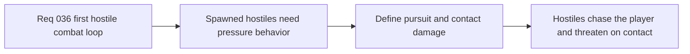

## item_135_define_hostile_focus_pursuit_and_contact_damage_for_the_first_combat_loop - Define hostile focus pursuit and contact damage for the first combat loop
> From version: 0.2.3
> Status: Draft
> Understanding: 100%
> Confidence: 97%
> Progress: 0%
> Complexity: Medium
> Theme: Gameplay
> Reminder: Update status/understanding/confidence/progress and linked task references when you edit this doc.

# Problem
- Hostiles need a minimal behavior loop to create pressure; otherwise spawning them only creates inert obstacles.
- The requested first enemy attack is collision contact, which needs a pursuit trigger and a bounded damage cadence to be readable.

# Scope
- In: defining hostile focus on the player, simple pursuit behavior toward the player, and contact-based enemy damage with a cooldown.
- Out: pathfinding, ranged behaviors, multi-state aggro systems, or complex target memory.

# Acceptance criteria
- AC1: The slice defines a first hostile focus posture centered on the player.
- AC2: The slice defines a direct pursuit behavior toward the player strongly enough to guide implementation.
- AC3: The slice defines hostile contact damage with a bounded cadence or cooldown.
- AC4: The slice stays within the narrow first-loop scope and does not reopen pathfinding or advanced AI systems.

# Links
- Request: `req_036_define_a_first_hostile_combat_loop_with_spawns_contact_damage_and_player_cone_attack`

# Notes
- Derived from request `req_036_define_a_first_hostile_combat_loop_with_spawns_contact_damage_and_player_cone_attack`.
