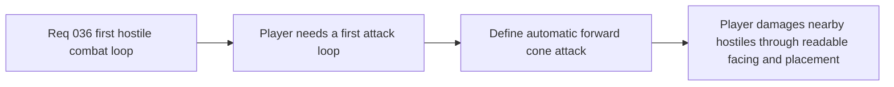

## item_136_define_an_automatic_forward_player_cone_attack_for_first_hostile_combat - Define an automatic forward player cone attack for first hostile combat
> From version: 0.2.3
> Status: Done
> Understanding: 100%
> Confidence: 100%
> Progress: 100%
> Complexity: Medium
> Theme: Gameplay
> Reminder: Update status/understanding/confidence/progress and linked task references when you edit this doc.

# Problem
- The player needs an offensive action in the first combat loop, but the requested posture is automatic rather than input-triggered.
- Without a bounded attack shape, cadence, and targeting rule, automatic combat risks becoming unreadable or overly passive.

# Scope
- In: defining an automatic forward cone attack with bounded arc, reach, multi-hit posture, and cooldown behavior.
- Out: manual combo input, projectiles, charge systems, animation-heavy attack state machines, or multiple attack archetypes.

# Acceptance criteria
- AC1: The slice defines an automatic forward-facing cone attack strongly enough to guide implementation.
- AC2: The slice defines enough specificity for arc, reach, and cooldown to keep the first attack readable.
- AC3: The slice defines whether the first attack can hit multiple hostile targets.
- AC4: The slice preserves the requested no-input posture for the first player attack.

# Links
- Request: `req_036_define_a_first_hostile_combat_loop_with_spawns_contact_damage_and_player_cone_attack`

# Notes
- Derived from request `req_036_define_a_first_hostile_combat_loop_with_spawns_contact_damage_and_player_cone_attack`.
- Implemented in `4c60012`.
- The player now attacks automatically through a bounded forward cone:
  - `120°` arc
  - medium reach
  - short cooldown
  - multi-hit damage against every hostile inside the cone.
