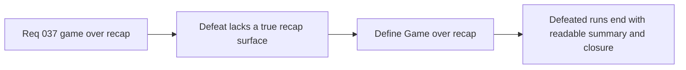

## item_137_define_a_game_over_recap_surface_for_defeated_runs - Define a game-over recap surface for defeated runs
> From version: 0.2.3
> Status: Done
> Understanding: 100%
> Confidence: 100%
> Progress: 100%
> Complexity: Medium
> Theme: Gameplay
> Reminder: Update status/understanding/confidence/progress and linked task references when you edit this doc.

# Problem
- Player defeat currently resolves structurally, but not yet through a real `Game over` recap surface that closes the run with readable context.
- Without a dedicated recap slice, defeat risks feeling abrupt and under-informative even though the shell already owns the failure handoff.

# Scope
- In: defining a shell-owned `Game over` recap surface, its first-slice recap contents, and its relation to the defeated run.
- Out: long-form run history, reward summary systems, or multi-page end-of-run analytics.

# Acceptance criteria
- AC1: The slice defines a shell-owned `Game over` recap strongly enough to guide implementation.
- AC2: The slice defines a bounded first-slice set of recap information for the defeated run.
- AC3: The slice defines how the recap relates to the just-finished run without reopening a broad run-history system.
- AC4: The slice stays intentionally narrow and does not drift into rewards, loot summaries, or analytics-heavy end screens.

# Links
- Request: `req_037_define_a_game_over_recap_flow_and_player_attack_cone_visualization`

# Notes
- Derived from request `req_037_define_a_game_over_recap_flow_and_player_attack_cone_visualization`.
- Implemented in `13db4e2`.
- The `defeat` scene now renders a true `Game over` recap with bounded run-summary facts instead of a generic interruption panel.
