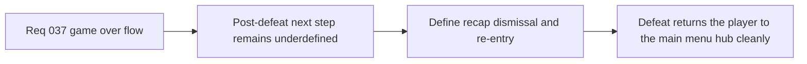

## item_138_define_post_recap_return_to_main_menu_and_reentry_options - Define post-recap return to main menu and re-entry options
> From version: 0.2.3
> Status: Draft
> Understanding: 100%
> Confidence: 97%
> Progress: 0%
> Complexity: Medium
> Theme: UX
> Reminder: Update status/understanding/confidence/progress and linked task references when you edit this doc.

# Problem
- A game-over recap is incomplete unless the player’s next step after defeat is explicit and product-coherent.
- Without a dedicated transition slice, post-defeat navigation may continue to imply that the dead run can simply resume instead of returning to the main hub.

# Scope
- In: defining recap dismissal behavior, return to `Main menu`, and first post-defeat re-entry options such as `Load game` and `Start new game`.
- Out: save-slot redesign, profile management, or broader main-menu IA redesign outside the defeat aftermath.

# Acceptance criteria
- AC1: The slice defines what happens when the player closes or acknowledges the game-over recap.
- AC2: The slice defines that post-recap routing returns the player to `Main menu`.
- AC3: The slice defines the first re-entry options after defeat around `Load game` and `Start new game`.
- AC4: The slice avoids implying that the defeated run should be resumed as the default next action.

# Links
- Request: `req_037_define_a_game_over_recap_flow_and_player_attack_cone_visualization`

# Notes
- Derived from request `req_037_define_a_game_over_recap_flow_and_player_attack_cone_visualization`.
