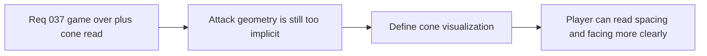

## item_139_define_a_player_attack_cone_visualization_aligned_with_runtime_combat_geometry - Define a player attack-cone visualization aligned with runtime combat geometry
> From version: 0.5.0
> Status: Done
> Understanding: 100%
> Confidence: 100%
> Progress: 100%
> Complexity: Medium
> Theme: Gameplay
> Reminder: Update status/understanding/confidence/progress and linked task references when you edit this doc.

# Problem
- The player’s automatic cone attack exists mechanically, but its spatial reach is still too implicit for strong player-facing readability.
- Without a dedicated visualization slice, the attack can feel inconsistent or hard to learn even when the combat geometry itself is deterministic.

# Scope
- In: defining a first visual telegraph for the player’s attack cone, aligned with the actual attack arc, range, and facing.
- Out: broad combat FX systems, hit flashes, combo animation, or a full readability/VFX redesign.

# Acceptance criteria
- AC1: The slice defines a first visual treatment for the player attack cone strongly enough to guide implementation.
- AC2: The slice defines how the displayed cone aligns with the real combat geometry.
- AC3: The slice defines when the cone is shown strongly enough to keep readability without creating a permanent noisy overlay.
- AC4: The slice stays intentionally narrow and does not reopen a full combat-VFX system.

# Request AC Traceability
- req_037_define_a_game_over_recap_flow_and_player_attack_cone_visualization coverage: AC1, AC2, AC3, AC4, AC5, AC6. Proof: `item_139_define_a_player_attack_cone_visualization_aligned_with_runtime_combat_geometry` remains the request-closing backlog slice for `req_037_define_a_game_over_recap_flow_and_player_attack_cone_visualization` and stays linked to `task_040_orchestrate_game_over_recap_and_proximity_loot_wave` for delivered implementation evidence.

# Links
- Request: `req_037_define_a_game_over_recap_flow_and_player_attack_cone_visualization`

# Notes
- Derived from request `req_037_define_a_game_over_recap_flow_and_player_attack_cone_visualization`.
- Implemented in `13db4e2`.
- The player’s automatic attack now renders a short world-space cone pulse that follows the live orientation and uses the same arc/range as the combat contract.
