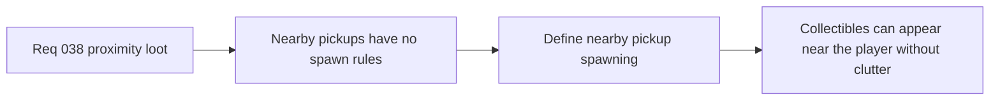

## item_140_define_nearby_pickup_spawn_rules_around_the_player - Define nearby pickup spawn rules around the player
> From version: 0.2.3
> Status: Draft
> Understanding: 100%
> Confidence: 97%
> Progress: 0%
> Complexity: Medium
> Theme: Gameplay
> Reminder: Update status/understanding/confidence/progress and linked task references when you edit this doc.

# Problem
- The runtime now has damage and survival pressure, but no nearby pickup layer to create immediate world rewards or recovery opportunities.
- Without a bounded spawn-rules slice, pickups risk either never appearing or cluttering the player’s vicinity unpredictably.

# Scope
- In: defining first nearby pickup spawn rules around the player, including bounded local placement and safe spawn posture in traversable space.
- Out: global loot direction, authored treasure placement, or inventory/economy redesign.

# Acceptance criteria
- AC1: The slice defines a bounded nearby-pickup spawn posture strongly enough to guide implementation.
- AC2: The slice defines how pickups appear near the player without spawning directly on top of them.
- AC3: The slice defines that pickups must respect traversable world space.
- AC4: The slice stays narrow and does not drift into a broad encounter or economy system.

# Links
- Request: `req_038_define_a_first_proximity_loot_spawn_wave_with_healing_kits_and_gold`

# Notes
- Derived from request `req_038_define_a_first_proximity_loot_spawn_wave_with_healing_kits_and_gold`.
