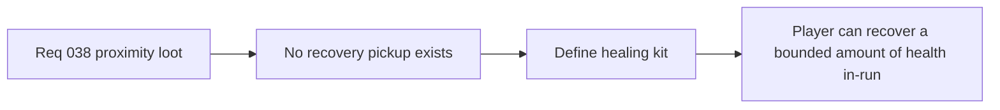

## item_141_define_a_first_healing_kit_pickup_that_restores_25_percent_health - Define a first healing-kit pickup that restores 25 percent health
> From version: 0.2.3
> Status: Done
> Understanding: 100%
> Confidence: 100%
> Progress: 100%
> Complexity: Medium
> Theme: Gameplay
> Reminder: Update status/understanding/confidence/progress and linked task references when you edit this doc.

# Problem
- The player can now take damage, but there is no first in-run recovery pickup to offset survival pressure.
- Without a dedicated healing-kit slice, any future pickup wave risks lacking a clear restorative effect contract.

# Scope
- In: defining a first healing-kit pickup, its collection posture, and its effect of restoring `25%` of player max health with a max-health clamp.
- Out: inventories, consumable storage, overheal systems, or broad healing-system design.

# Acceptance criteria
- AC1: The slice defines a first healing-kit pickup strongly enough to guide implementation.
- AC2: The slice defines that the healing kit restores `25%` of player max health.
- AC3: The slice defines that healing is clamped at max health.
- AC4: The slice keeps the first recovery pickup narrow and avoids reopening a wider consumables system.

# Links
- Request: `req_038_define_a_first_proximity_loot_spawn_wave_with_healing_kits_and_gold`

# Notes
- Derived from request `req_038_define_a_first_proximity_loot_spawn_wave_with_healing_kits_and_gold`.
- Implemented in `13db4e2`.
- Healing kits now collect automatically on contact and restore `25%` of player max health with a max-health clamp.
