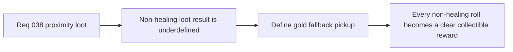

## item_142_define_gold_as_the_default_fallback_pickup_and_first_runtime_currency_counter - Define gold as the default fallback pickup and first runtime currency counter
> From version: 0.5.0
> Status: Done
> Understanding: 100%
> Confidence: 100%
> Progress: 100%
> Complexity: Medium
> Theme: Gameplay
> Reminder: Update status/understanding/confidence/progress and linked task references when you edit this doc.

# Problem
- A loot table with only a healing-kit chance is incomplete unless the non-healing outcome is also defined explicitly.
- Without a default fallback pickup, nearby loot generation risks creating empty rolls or ambiguous reward behavior.

# Scope
- In: defining `gold` as the default fallback pickup and establishing a first runtime-only currency counter or count posture.
- Out: spending loops, vendors, persistent economy balancing, or rarity/value systems.

# Acceptance criteria
- AC1: The slice defines `gold` as the default fallback outcome when the healing-kit roll does not occur.
- AC2: The slice defines a first runtime currency-count posture strongly enough to guide implementation.
- AC3: The slice defines how gold is collected in the same first pickup loop.
- AC4: The slice stays narrow and does not reopen a broader economy or spending system.

# Request AC Traceability
- req_038_define_a_first_proximity_loot_spawn_wave_with_healing_kits_and_gold coverage: AC1, AC2, AC3, AC4, AC5, AC6. Proof: `item_142_define_gold_as_the_default_fallback_pickup_and_first_runtime_currency_counter` remains the request-closing backlog slice for `req_038_define_a_first_proximity_loot_spawn_wave_with_healing_kits_and_gold` and stays linked to `task_040_orchestrate_game_over_recap_and_proximity_loot_wave` for delivered implementation evidence.

# Links
- Request: `req_038_define_a_first_proximity_loot_spawn_wave_with_healing_kits_and_gold`

# Notes
- Derived from request `req_038_define_a_first_proximity_loot_spawn_wave_with_healing_kits_and_gold`.
- Implemented in `13db4e2`.
- Gold now acts as the default fallback pickup and increments the first runtime currency counter used by the HUD and game-over recap.
