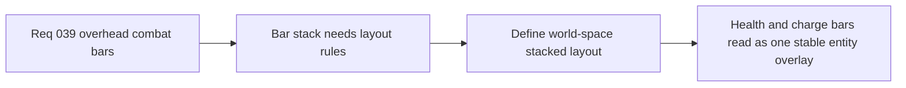

## item_145_define_world_space_layout_rules_for_stacked_combat_bars_above_entities - Define world-space layout rules for stacked combat bars above entities
> From version: 0.2.3
> Status: Done
> Understanding: 100%
> Confidence: 100%
> Progress: 100%
> Complexity: Medium
> Theme: Gameplay
> Reminder: Update status/understanding/confidence/progress and linked task references when you edit this doc.

# Problem
- Health and charge bars need a stable vertical relationship or the overlay stack will become inconsistent and noisy.
- Without explicit layout rules, combat bars can overlap awkwardly or lose readability.

# Scope
- In: defining vertical ordering and spacing for overhead combat bars in world space.
- Out: full nameplates, target markers, or expanded entity UI stacks.

# Acceptance criteria
- AC1: The slice defines the ordering as health bar above and charge bar directly below it.
- AC2: The slice defines bounded spacing and placement relative to the entity footprint.
- AC3: The slice keeps the layout world-space and lightweight.
- AC4: The slice stays narrow and does not drift into richer nameplate systems.

# Links
- Request: `req_039_define_overhead_health_and_attack_charge_bars_for_runtime_combatants`

# Notes
- Derived from request `req_039_define_overhead_health_and_attack_charge_bars_for_runtime_combatants`.
- Implemented in `a27102c`.
- Health bars now render above charge bars in a compact stacked world-space layout above combatants.
