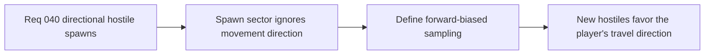

## item_146_define_forward_biased_spawn_sampling_for_moving_player_states - Define forward-biased spawn sampling for moving player states
> From version: 0.2.3
> Status: Done
> Understanding: 100%
> Confidence: 100%
> Progress: 100%
> Complexity: Medium
> Theme: Gameplay
> Reminder: Update status/understanding/confidence/progress and linked task references when you edit this doc.

# Problem
- Hostile spawns currently ignore meaningful player movement direction.
- Without forward-biased sampling, too many spawns can still feel rear-weighted or spatially arbitrary.

# Scope
- In: defining a forward-biased spawn sector when the player is actively moving.
- Out: a full encounter director, objective-aware spawns, or guaranteed always-in-front placement.

# Acceptance criteria
- AC1: The slice defines a forward-biased spawn posture strongly enough to guide implementation.
- AC2: The slice defines movement intent as the primary forward reference with bounded fallback.
- AC3: The slice keeps the solution deterministic and compatible with current spawn safety rules.
- AC4: The slice stays narrow and does not widen into a large encounter-direction system.

# Links
- Request: `req_040_define_directionally_biased_hostile_spawns_ahead_of_player_movement`

# Notes
- Derived from request `req_040_define_directionally_biased_hostile_spawns_ahead_of_player_movement`.
- Implemented in `a27102c`.
- Hostile spawn sampling now prefers forward-biased sectors when the player is moving meaningfully.
