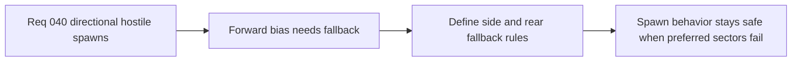

## item_147_define_fallback_spawn_sector_rules_when_preferred_forward_positions_fail - Define fallback spawn sector rules when preferred forward positions fail
> From version: 0.2.3
> Status: Done
> Understanding: 100%
> Confidence: 100%
> Progress: 100%
> Complexity: Medium
> Theme: Gameplay
> Reminder: Update status/understanding/confidence/progress and linked task references when you edit this doc.

# Problem
- A forward bias without fallback rules can create unstable or invalid spawn behavior when preferred sectors are blocked.
- The system needs explicit secondary sectors and safe fallback posture.

# Scope
- In: defining side and rear fallback rules when preferred forward spawn candidates fail.
- Out: global encounter balancing or cinematic spawn choreography.

# Acceptance criteria
- AC1: The slice defines side-biased fallback behavior after forward candidates fail.
- AC2: The slice defines rear-biased spawns as rare fallback rather than equal-probability default.
- AC3: The slice preserves current safety constraints while changing only directional priority.
- AC4: The slice stays narrow and does not drift into a global encounter controller.

# Links
- Request: `req_040_define_directionally_biased_hostile_spawns_ahead_of_player_movement`

# Notes
- Derived from request `req_040_define_directionally_biased_hostile_spawns_ahead_of_player_movement`.
- Implemented in `a27102c`.
- Spawn retries now fall back deterministically through side sectors before rear-biased sectors.
