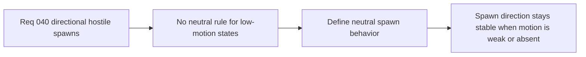

## item_148_define_neutral_spawn_behavior_when_player_motion_is_not_meaningful - Define neutral spawn behavior when player motion is not meaningful
> From version: 0.2.3
> Status: Draft
> Understanding: 100%
> Confidence: 98%
> Progress: 0%
> Complexity: Medium
> Theme: Gameplay
> Reminder: Update status/understanding/confidence/progress and linked task references when you edit this doc.

# Problem
- Direction-biased spawning needs a stable neutral mode when the player is not meaningfully moving.
- Without a neutral rule, low-motion edge cases can produce erratic sector selection.

# Scope
- In: defining spawn behavior when movement intent or velocity is too weak to determine a forward direction.
- Out: advanced behavioral prediction or full recent-motion analytics.

# Acceptance criteria
- AC1: The slice defines a neutral spawn posture when player motion is not meaningful.
- AC2: The slice defines when directional bias should be disabled or relaxed.
- AC3: The slice stays compatible with the deterministic current spawn system.
- AC4: The slice stays narrow and avoids broader prediction logic.

# Links
- Request: `req_040_define_directionally_biased_hostile_spawns_ahead_of_player_movement`

# Notes
- Derived from request `req_040_define_directionally_biased_hostile_spawns_ahead_of_player_movement`.
