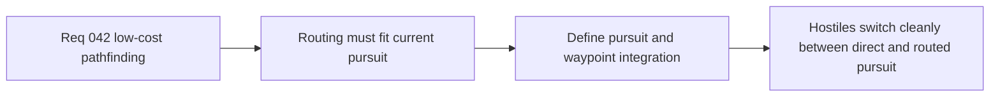

## item_154_define_direct_pursuit_fallback_and_waypoint_following_integration_for_hostiles - Define direct-pursuit fallback and waypoint-following integration for hostiles
> From version: 0.2.3
> Status: Draft
> Understanding: 100%
> Confidence: 98%
> Progress: 0%
> Complexity: Medium
> Theme: Gameplay
> Reminder: Update status/understanding/confidence/progress and linked task references when you edit this doc.

# Problem
- Pathfinding must integrate cleanly with the current hostile pursuit loop rather than replacing it wholesale.
- Without an integration contract, hostiles can oscillate between routing and direct steering.

# Scope
- In: defining when hostiles use direct pursuit, when they use waypoints, and how they fall back.
- Out: advanced multi-stage AI state machines or coordination systems.

# Acceptance criteria
- AC1: The slice defines how direct pursuit remains the default when unobstructed.
- AC2: The slice defines how waypoint-following or routed pursuit activates when needed.
- AC3: The slice defines safe fallback when routing fails.
- AC4: The slice stays narrow and does not widen into a complex AI-state redesign.

# Links
- Request: `req_042_define_a_low_cost_first_pathfinding_slice_for_runtime_entities`

# Notes
- Derived from request `req_042_define_a_low_cost_first_pathfinding_slice_for_runtime_entities`.
