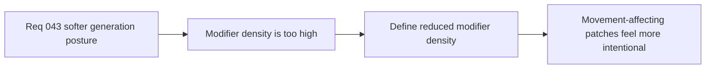

## item_156_define_a_reduced_surface_modifier_generation_density_for_runtime_world_chunks - Define a reduced surface-modifier generation density for runtime world chunks
> From version: 0.2.3
> Status: Draft
> Understanding: 100%
> Confidence: 98%
> Progress: 0%
> Complexity: Medium
> Theme: World generation
> Reminder: Update status/understanding/confidence/progress and linked task references when you edit this doc.

# Problem
- Slow/slippery modifiers currently appear more often than the desired softer movement-surface posture.
- Without a dedicated density-reduction slice, modifier zones remain too common and noisy.

# Scope
- In: defining reduced effective slow/slippery zone density in generated chunks.
- Out: movement-system redesign or broad modifier taxonomy changes.

# Acceptance criteria
- AC1: The slice defines a reduced effective movement-modifier density strongly enough to guide implementation.
- AC2: The slice targets about half the current effective modifier-zone frequency.
- AC3: The slice preserves current relative modifier balance unless explicitly changed later.
- AC4: The slice stays narrow and does not reopen broader surface taxonomy design.

# Links
- Request: `req_043_define_a_softer_and_more_clustered_blocking_and_surface_generation_posture`

# Notes
- Derived from request `req_043_define_a_softer_and_more_clustered_blocking_and_surface_generation_posture`.
