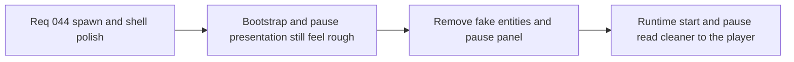

## item_159_remove_fake_bootstrap_entities_and_pause_overlay_surface - Remove fake bootstrap entities and pause overlay surface
> From version: 0.2.3
> Status: Draft
> Understanding: 100%
> Confidence: 98%
> Progress: 0%
> Complexity: Medium
> Theme: Gameplay
> Reminder: Update status/understanding/confidence/progress and linked task references when you edit this doc.

# Problem
- New runs still expose fake/bootstrap runtime entities that are not intended to read as real gameplay actors.
- Pause still renders a dedicated explanatory panel even though the useful shell controls already exist elsewhere.

# Scope
- In: removing fake/bootstrap support entities from player-facing runtime start, selection, and targeting; suppressing the dedicated `Runtime paused` panel.
- Out: debug-surface removal, runtime bootstrap redesign, or broader pause-scene UX redesign.

# Acceptance criteria
- AC1: The slice defines removal of fake/bootstrap entities from normal player-facing runtime presentation strongly enough to guide implementation.
- AC2: The slice defines that those entities also disappear from normal selection and targeting behavior.
- AC3: The slice defines removal of the dedicated `Runtime paused` panel while preserving pause ownership.
- AC4: The slice stays narrow and does not widen into debug tooling or pause-flow redesign.

# Links
- Request: `req_044_refine_spawn_bootstrap_pause_surface_and_escape_navigation_behaviors`

# Notes
- Derived from request `req_044_refine_spawn_bootstrap_pause_surface_and_escape_navigation_behaviors`.
