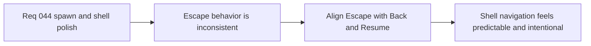

## item_160_align_escape_navigation_with_visible_back_and_resume_actions - Align escape navigation with visible back and resume actions
> From version: 0.2.3
> Status: Draft
> Understanding: 100%
> Confidence: 98%
> Progress: 0%
> Complexity: Medium
> Theme: UX
> Reminder: Update status/understanding/confidence/progress and linked task references when you edit this doc.

# Problem
- `Escape` does not yet mirror visible `Back` actions consistently across shell-owned menus and submenus.
- `Main menu` still lacks the expected `Escape => Resume runtime` behavior when that action is available.

# Scope
- In: routing `Escape` through visible `Back` actions, local input/capture cancellation first, deck back/close behavior, and `Main menu` resume behavior.
- Out: wholesale keyboard-navigation redesign or new global hotkey systems.

# Acceptance criteria
- AC1: The slice defines `Escape` routing through visible `Back` actions strongly enough to guide implementation.
- AC2: The slice defines that local focused input or capture should consume `Escape` before broader shell navigation.
- AC3: The slice defines that `Main menu` should treat `Escape` as `Resume runtime` when that action is visible and available.
- AC4: The slice stays narrow and does not widen into a broader hotkey or navigation-system rewrite.

# Links
- Request: `req_044_refine_spawn_bootstrap_pause_surface_and_escape_navigation_behaviors`

# Notes
- Derived from request `req_044_refine_spawn_bootstrap_pause_surface_and_escape_navigation_behaviors`.
