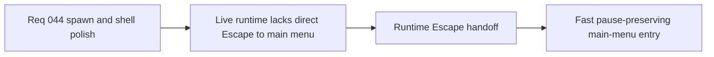

## item_161_define_escape_from_live_runtime_to_main_menu_with_session_preservation - Define escape from live runtime to main menu with session preservation
> From version: 0.5.0
> Status: Done
> Understanding: 100%
> Confidence: 98%
> Progress: 100%
> Complexity: Medium
> Theme: UX
> Reminder: Update status/understanding/confidence/progress and linked task references when you edit this doc.

# Problem
- `Escape` still does not open `Main menu` directly from the live runtime.
- The player lacks a fast keyboard path to a shell-owned pause/menu state while actively playing.

# Scope
- In: routing `Escape` from live runtime to `Main menu`, preserving the active session, and respecting existing deck/capture priority.
- Out: broader keyboard-navigation redesign or pause-scene redesign.

# Acceptance criteria
- AC1: The slice defines that `Escape` from live runtime opens `Main menu`.
- AC2: The slice defines that the active session is preserved, so runtime effectively pauses through shell ownership.
- AC3: The slice preserves existing priority rules for open command-deck navigation and local capture/input handling.
- AC4: The slice stays narrow and does not widen into broader scene-navigation redesign.

# Request AC Traceability
- req_044_refine_spawn_bootstrap_pause_surface_and_escape_navigation_behaviors coverage: AC1, AC2, AC3, AC4, AC5, AC6, AC7, AC8. Proof: `item_161_define_escape_from_live_runtime_to_main_menu_with_session_preservation` remains the request-closing backlog slice for `req_044_refine_spawn_bootstrap_pause_surface_and_escape_navigation_behaviors` and stays linked to `task_043_orchestrate_runtime_memory_structure_generation_and_settings_polish_wave` for delivered implementation evidence.

# Links
- Request: `req_044_refine_spawn_bootstrap_pause_surface_and_escape_navigation_behaviors`

# Notes
- Derived from request `req_044_refine_spawn_bootstrap_pause_surface_and_escape_navigation_behaviors`.
- Delivered in `task_043_orchestrate_runtime_memory_structure_generation_and_settings_polish_wave`.
