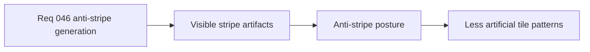

## item_165_define_an_anti_stripe_generation_posture_for_special_tiles - Define an anti-stripe generation posture for special tiles
> From version: 0.2.3
> Status: Done
> Understanding: 100%
> Confidence: 98%
> Progress: 100%
> Complexity: Medium
> Theme: Gameplay
> Reminder: Update status/understanding/confidence/progress and linked task references when you edit this doc.

# Problem
- Generated special tiles still read as long lines or columns.
- The world can look sampled by rails instead of by grouped areas.

# Scope
- In: anti-stripe posture for special-tile generation at the visible map level.
- Out: full biome redesign or new tile-family work.

# Acceptance criteria
- AC1: The slice defines long stripe/column runs as an explicit generation defect.
- AC2: The slice defines a correction posture that reduces visible stripe artifacts.
- AC3: The slice stays narrow and does not widen into full world redesign.
- AC4: The slice remains deterministic.

# Links
- Request: `req_046_define_a_non_linear_tile_generation_posture_that_avoids_stripes_and_columns`

# Notes
- Derived from request `req_046_define_a_non_linear_tile_generation_posture_that_avoids_stripes_and_columns`.
- Delivered in `task_043_orchestrate_runtime_memory_structure_generation_and_settings_polish_wave`.
