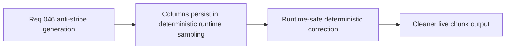

## item_167_define_runtime_safe_deterministic_sampling_that_reduces_visible_column_artifacts - Define runtime-safe deterministic sampling that reduces visible column artifacts
> From version: 0.5.0
> Status: Done
> Understanding: 100%
> Confidence: 98%
> Progress: 100%
> Complexity: Medium
> Theme: Performance
> Reminder: Update status/understanding/confidence/progress and linked task references when you edit this doc.

# Problem
- The current deterministic generation posture still produces player-visible column artifacts.
- Any correction must remain cheap enough for runtime sampling.

# Scope
- In: deterministic, runtime-safe sampling adjustments that reduce visible column artifacts.
- Out: expensive offline generation pipelines or unrelated performance work.

# Acceptance criteria
- AC1: The slice defines a deterministic correction posture for column artifacts.
- AC2: The slice preserves runtime-safe cost characteristics.
- AC3: The slice avoids reopening unrelated world-generation systems.
- AC4: The slice stays focused on visible artifact reduction.

# Request AC Traceability
- req_046_define_a_non_linear_tile_generation_posture_that_avoids_stripes_and_columns coverage: AC1, AC2, AC3, AC4, AC5. Proof: `item_167_define_runtime_safe_deterministic_sampling_that_reduces_visible_column_artifacts` remains the request-closing backlog slice for `req_046_define_a_non_linear_tile_generation_posture_that_avoids_stripes_and_columns` and stays linked to `task_043_orchestrate_runtime_memory_structure_generation_and_settings_polish_wave` for delivered implementation evidence.

# Links
- Request: `req_046_define_a_non_linear_tile_generation_posture_that_avoids_stripes_and_columns`

# Notes
- Derived from request `req_046_define_a_non_linear_tile_generation_posture_that_avoids_stripes_and_columns`.
- Delivered in `task_043_orchestrate_runtime_memory_structure_generation_and_settings_polish_wave`.
