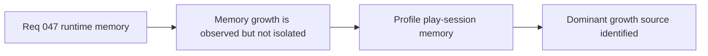

## item_168_profile_runtime_memory_growth_during_normal_play_sessions - Profile runtime memory growth during normal play sessions
> From version: 0.2.3
> Status: Draft
> Understanding: 100%
> Confidence: 97%
> Progress: 0%
> Complexity: High
> Theme: Performance
> Reminder: Update status/understanding/confidence/progress and linked task references when you edit this doc.

# Problem
- Normal play sessions appear to drive browser-tab memory too high.
- The project currently lacks evidence that distinguishes true leaks from allocation churn or retained renderer resources.

# Scope
- In: browser-side profiling, heap/resource inspection, and repeatable memory-observation workflow.
- Out: speculative fixes without evidence or unrelated bundle/startup optimization.

# Acceptance criteria
- AC1: The slice defines a repeatable profiling workflow for runtime memory growth.
- AC2: The slice distinguishes JS heap, render churn, and retained Pixi/canvas resources.
- AC3: The slice produces evidence strong enough to guide follow-up fixes.
- AC4: The slice stays investigation-first.

# Links
- Request: `req_047_define_a_runtime_memory_growth_investigation_and_reduction_wave`

# Notes
- Derived from request `req_047_define_a_runtime_memory_growth_investigation_and_reduction_wave`.
